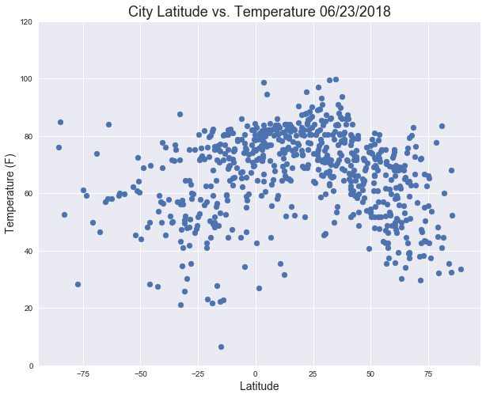
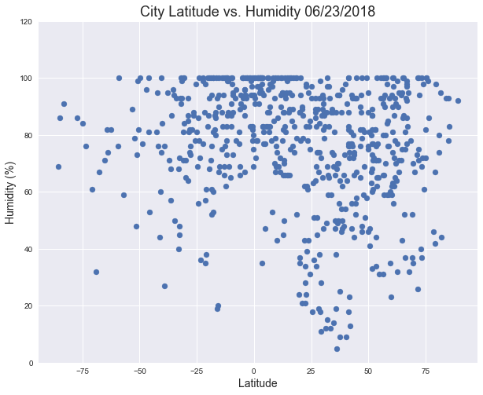
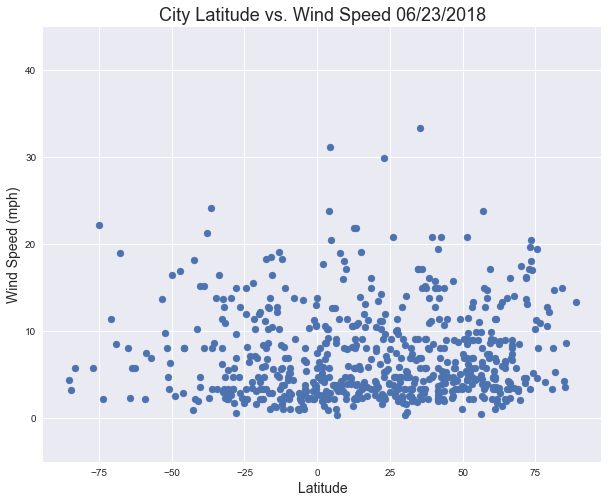
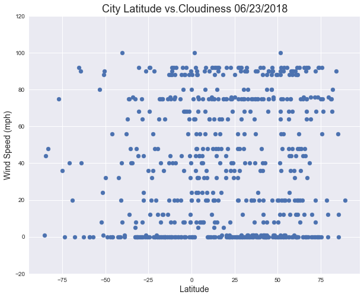

## Analysis

1- Temperatures tend to be warmer near the equator (0 latitude) and cool down the further you get away from it. However, the highest temperatures actually tend to be in the zero to ~40 latitude range, most likely as a result of seasonality affects between the hemispheres. The positive latitudes are representative of the northern hemisphere which is currently in the summer season.

2- Wind speeds tend to range between 0 and 20 mph for most cities; over half actually  to be grouped closer to the 0 to 10mph range. There doesn't appear to be a relationship between wind speed and latitude.

3- There appears to be no relationship between latitude and cloudiness or latitude and humidity. Very few cities (only 3) have 100% cloudiness.


```python
# Dependencies and Setup
import matplotlib.pyplot as plt
import pandas as pd
import numpy as np
import requests
import time
import datetime
import seaborn as sns

# Import API key
import api_keys

# Incorporated citipy to determine city based on latitude and longitude
from citipy import citipy

# Range of latitudes and longitudes
lat_range = (-90, 90)
lng_range = (-180, 180)
```

## Generate Cities List


```python
# List for holding lat_lngs and cities
lat_lngs = []
cities = []
lat_lng_list = []

# Create a set of random lat and lng combinations
lats = np.random.uniform(low=-90.000, high=90.000, size=2000)
lngs = np.random.uniform(low=-180.000, high=180.000, size=2000)
lat_lngs = zip(lats, lngs)

# Identify nearest city for each lat, lng combination
for lat_lng in lat_lngs:
    city = citipy.nearest_city(lat_lng[0], lat_lng[1]).city_name
    
    # If the city is unique, then add it to a our cities list
    if city not in cities:
        cities.append(city)
        lat_lng_list.append(lat_lng)

# Print the city count to confirm sufficient count
len(cities)
```


    752


```python
#Create dataframe with list of cities
df = pd.DataFrame(cities)
df = df.rename(columns={0: 'city'})

#Add lat and lngs to dataframe, create separate columns for lats and longs
df['lat_lngs'] = lat_lng_list
df['lat'] = df.lat_lngs.map(lambda x: str(x[0]))
df['long'] = df.lat_lngs.map(lambda x: str(x[1]))

df.head()
```


<div>
<style scoped>
    .dataframe tbody tr th:only-of-type {
        vertical-align: middle;
    }

    .dataframe tbody tr th {
        vertical-align: top;
    }

    .dataframe thead th {
        text-align: right;
    }
</style>
<table border="1" class="dataframe">
  <thead>
    <tr style="text-align: right;">
      <th></th>
      <th>city</th>
      <th>lat_lngs</th>
      <th>lat</th>
      <th>long</th>
    </tr>
  </thead>
  <tbody>
    <tr>
      <th>0</th>
      <td>chokurdakh</td>
      <td>(85.42215126291109, 151.4609073078435)</td>
      <td>85.42215126291109</td>
      <td>151.4609073078435</td>
    </tr>
    <tr>
      <th>1</th>
      <td>saskylakh</td>
      <td>(75.51116616852792, 113.28174418310283)</td>
      <td>75.51116616852792</td>
      <td>113.28174418310283</td>
    </tr>
    <tr>
      <th>2</th>
      <td>karamay</td>
      <td>(45.91820310375911, 83.12042932434247)</td>
      <td>45.91820310375911</td>
      <td>83.12042932434247</td>
    </tr>
    <tr>
      <th>3</th>
      <td>yagodnoye</td>
      <td>(62.72766031540087, 149.94810241572702)</td>
      <td>62.72766031540087</td>
      <td>149.94810241572702</td>
    </tr>
    <tr>
      <th>4</th>
      <td>lavrentiya</td>
      <td>(66.83491701038781, -172.3799243808506)</td>
      <td>66.83491701038781</td>
      <td>-172.3799243808506</td>
    </tr>
  </tbody>
</table>
</div>


## Perform API Calls


```python
api_key = '67a967de9a443f2e193b7add12252b46' #deactivated

#Create new columns for data we'll be collecting from the API
df['temp'] = ""
df['max_temp'] = ""
df['humidity'] = ""
df['wind_speed'] = ""
df['clouds'] = ""

#Iterate over each row
for index, row in df.iterrows():
    city = row['city']
    print(f"Processing Record {index + 1} | {city}")
    city = city.replace(" ", "&")
    url = "http://api.openweathermap.org/data/2.5/weather?units=Imperial&q=" + city + "&APPID=" + api_key
    print(url)
    weather = requests.get(url).json()
    try:
        df.loc[index, 'temp'] = weather['main']['temp']
        df.loc[index, 'max_temp'] = weather['main']['temp_max']
        df.loc[index, 'humidity'] = weather['main']['humidity']
        df.loc[index, 'wind_speed'] = weather['wind']['speed']
        df.loc[index, 'clouds'] = weather['clouds']['all']
    except:
        df.loc[index, 'temp'] = 'city not found'
        df.loc[index, 'humidity'] = 'city not found'
        df.loc[index, 'wind_speed'] = 'city not found'
        df.loc[index, 'clouds'] = 'city not found'
    time.sleep(.50)
    
print("----------------------")
print("Data Retrieval Complete")
print("-----------------------")
```

    Processing Record 1 | chokurdakh
    http://api.openweathermap.org/data/2.5/weather?units=Imperial&q=chokurdakh&APPID=67a967de9a443f2e193b7add12252b46
    Processing Record 2 | saskylakh
    http://api.openweathermap.org/data/2.5/weather?units=Imperial&q=saskylakh&APPID=67a967de9a443f2e193b7add12252b46
    Processing Record 3 | karamay
    http://api.openweathermap.org/data/2.5/weather?units=Imperial&q=karamay&APPID=67a967de9a443f2e193b7add12252b46
    Processing Record 4 | yagodnoye
    http://api.openweathermap.org/data/2.5/weather?units=Imperial&q=yagodnoye&APPID=67a967de9a443f2e193b7add12252b46
    Processing Record 5 | lavrentiya
    http://api.openweathermap.org/data/2.5/weather?units=Imperial&q=lavrentiya&APPID=67a967de9a443f2e193b7add12252b46
    Processing Record 6 | tsihombe
    http://api.openweathermap.org/data/2.5/weather?units=Imperial&q=tsihombe&APPID=67a967de9a443f2e193b7add12252b46
    Processing Record 7 | kwinana
    http://api.openweathermap.org/data/2.5/weather?units=Imperial&q=kwinana&APPID=67a967de9a443f2e193b7add12252b46
    Processing Record 8 | rikitea
    http://api.openweathermap.org/data/2.5/weather?units=Imperial&q=rikitea&APPID=67a967de9a443f2e193b7add12252b46
    Processing Record 9 | mataura
    http://api.openweathermap.org/data/2.5/weather?units=Imperial&q=mataura&APPID=67a967de9a443f2e193b7add12252b46
    Processing Record 10 | khatanga
    http://api.openweathermap.org/data/2.5/weather?units=Imperial&q=khatanga&APPID=67a967de9a443f2e193b7add12252b46
    Processing Record 11 | valavanur
    http://api.openweathermap.org/data/2.5/weather?units=Imperial&q=valavanur&APPID=67a967de9a443f2e193b7add12252b46
    Processing Record 12 | vila franca do campo
    http://api.openweathermap.org/data/2.5/weather?units=Imperial&q=vila&franca&do&campo&APPID=67a967de9a443f2e193b7add12252b46
    Processing Record 13 | port alfred
    http://api.openweathermap.org/data/2.5/weather?units=Imperial&q=port&alfred&APPID=67a967de9a443f2e193b7add12252b46
    Processing Record 14 | kapaa
    http://api.openweathermap.org/data/2.5/weather?units=Imperial&q=kapaa&APPID=67a967de9a443f2e193b7add12252b46
    Processing Record 15 | oistins
    http://api.openweathermap.org/data/2.5/weather?units=Imperial&q=oistins&APPID=67a967de9a443f2e193b7add12252b46
    Processing Record 16 | shakawe
    http://api.openweathermap.org/data/2.5/weather?units=Imperial&q=shakawe&APPID=67a967de9a443f2e193b7add12252b46
    Processing Record 17 | avarua
    http://api.openweathermap.org/data/2.5/weather?units=Imperial&q=avarua&APPID=67a967de9a443f2e193b7add12252b46
    Processing Record 18 | longyearbyen
    http://api.openweathermap.org/data/2.5/weather?units=Imperial&q=longyearbyen&APPID=67a967de9a443f2e193b7add12252b46
    Processing Record 19 | east london
    http://api.openweathermap.org/data/2.5/weather?units=Imperial&q=east&london&APPID=67a967de9a443f2e193b7add12252b46
    Processing Record 20 | lebu
    http://api.openweathermap.org/data/2.5/weather?units=Imperial&q=lebu&APPID=67a967de9a443f2e193b7add12252b46
    Processing Record 21 | jamestown
    http://api.openweathermap.org/data/2.5/weather?units=Imperial&q=jamestown&APPID=67a967de9a443f2e193b7add12252b46
    Processing Record 22 | chadiza
    http://api.openweathermap.org/data/2.5/weather?units=Imperial&q=chadiza&APPID=67a967de9a443f2e193b7add12252b46
    Processing Record 23 | aswan
    http://api.openweathermap.org/data/2.5/weather?units=Imperial&q=aswan&APPID=67a967de9a443f2e193b7add12252b46
    Processing Record 24 | barentsburg
    http://api.openweathermap.org/data/2.5/weather?units=Imperial&q=barentsburg&APPID=67a967de9a443f2e193b7add12252b46
    Processing Record 25 | taolanaro
    http://api.openweathermap.org/data/2.5/weather?units=Imperial&q=taolanaro&APPID=67a967de9a443f2e193b7add12252b46
    Processing Record 26 | aliwal north
    http://api.openweathermap.org/data/2.5/weather?units=Imperial&q=aliwal&north&APPID=67a967de9a443f2e193b7add12252b46
    Processing Record 27 | atuona
    http://api.openweathermap.org/data/2.5/weather?units=Imperial&q=atuona&APPID=67a967de9a443f2e193b7add12252b46
    Processing Record 28 | kargasok
    http://api.openweathermap.org/data/2.5/weather?units=Imperial&q=kargasok&APPID=67a967de9a443f2e193b7add12252b46
    Processing Record 29 | castro
    http://api.openweathermap.org/data/2.5/weather?units=Imperial&q=castro&APPID=67a967de9a443f2e193b7add12252b46
    Processing Record 30 | gamba
    http://api.openweathermap.org/data/2.5/weather?units=Imperial&q=gamba&APPID=67a967de9a443f2e193b7add12252b46
    Processing Record 31 | yellowknife
    http://api.openweathermap.org/data/2.5/weather?units=Imperial&q=yellowknife&APPID=67a967de9a443f2e193b7add12252b46
    Processing Record 32 | pindwara
    http://api.openweathermap.org/data/2.5/weather?units=Imperial&q=pindwara&APPID=67a967de9a443f2e193b7add12252b46
    Processing Record 33 | cervantes
    http://api.openweathermap.org/data/2.5/weather?units=Imperial&q=cervantes&APPID=67a967de9a443f2e193b7add12252b46
    Processing Record 34 | asau
    http://api.openweathermap.org/data/2.5/weather?units=Imperial&q=asau&APPID=67a967de9a443f2e193b7add12252b46
    Processing Record 35 | samusu
    http://api.openweathermap.org/data/2.5/weather?units=Imperial&q=samusu&APPID=67a967de9a443f2e193b7add12252b46
    Processing Record 36 | hobart
    http://api.openweathermap.org/data/2.5/weather?units=Imperial&q=hobart&APPID=67a967de9a443f2e193b7add12252b46
    Processing Record 37 | dalnerechensk
    http://api.openweathermap.org/data/2.5/weather?units=Imperial&q=dalnerechensk&APPID=67a967de9a443f2e193b7add12252b46
    Processing Record 38 | torbay
    http://api.openweathermap.org/data/2.5/weather?units=Imperial&q=torbay&APPID=67a967de9a443f2e193b7add12252b46
    Processing Record 39 | saleaula
    http://api.openweathermap.org/data/2.5/weather?units=Imperial&q=saleaula&APPID=67a967de9a443f2e193b7add12252b46
    Processing Record 40 | thompson
    http://api.openweathermap.org/data/2.5/weather?units=Imperial&q=thompson&APPID=67a967de9a443f2e193b7add12252b46
    Processing Record 41 | nikolskoye
    http://api.openweathermap.org/data/2.5/weather?units=Imperial&q=nikolskoye&APPID=67a967de9a443f2e193b7add12252b46
    Processing Record 42 | tuatapere
    http://api.openweathermap.org/data/2.5/weather?units=Imperial&q=tuatapere&APPID=67a967de9a443f2e193b7add12252b46
    Processing Record 43 | middleton
    http://api.openweathermap.org/data/2.5/weather?units=Imperial&q=middleton&APPID=67a967de9a443f2e193b7add12252b46
    Processing Record 44 | new norfolk
    http://api.openweathermap.org/data/2.5/weather?units=Imperial&q=new&norfolk&APPID=67a967de9a443f2e193b7add12252b46
    Processing Record 45 | tecpan
    http://api.openweathermap.org/data/2.5/weather?units=Imperial&q=tecpan&APPID=67a967de9a443f2e193b7add12252b46
    Processing Record 46 | corrales
    http://api.openweathermap.org/data/2.5/weather?units=Imperial&q=corrales&APPID=67a967de9a443f2e193b7add12252b46
    Processing Record 47 | talgar
    http://api.openweathermap.org/data/2.5/weather?units=Imperial&q=talgar&APPID=67a967de9a443f2e193b7add12252b46
    Processing Record 48 | provideniya
    http://api.openweathermap.org/data/2.5/weather?units=Imperial&q=provideniya&APPID=67a967de9a443f2e193b7add12252b46
    Processing Record 49 | myanaung
    http://api.openweathermap.org/data/2.5/weather?units=Imperial&q=myanaung&APPID=67a967de9a443f2e193b7add12252b46
    Processing Record 50 | cherskiy
    http://api.openweathermap.org/data/2.5/weather?units=Imperial&q=cherskiy&APPID=67a967de9a443f2e193b7add12252b46
    Processing Record 51 | kodiak
    http://api.openweathermap.org/data/2.5/weather?units=Imperial&q=kodiak&APPID=67a967de9a443f2e193b7add12252b46
    Processing Record 52 | saint anthony
    http://api.openweathermap.org/data/2.5/weather?units=Imperial&q=saint&anthony&APPID=67a967de9a443f2e193b7add12252b46
    Processing Record 53 | naze
    http://api.openweathermap.org/data/2.5/weather?units=Imperial&q=naze&APPID=67a967de9a443f2e193b7add12252b46
    Processing Record 54 | altamira
    http://api.openweathermap.org/data/2.5/weather?units=Imperial&q=altamira&APPID=67a967de9a443f2e193b7add12252b46
    Processing Record 55 | ushuaia
    http://api.openweathermap.org/data/2.5/weather?units=Imperial&q=ushuaia&APPID=67a967de9a443f2e193b7add12252b46
    Processing Record 56 | kahului
    http://api.openweathermap.org/data/2.5/weather?units=Imperial&q=kahului&APPID=67a967de9a443f2e193b7add12252b46
    Processing Record 57 | albany
    http://api.openweathermap.org/data/2.5/weather?units=Imperial&q=albany&APPID=67a967de9a443f2e193b7add12252b46
    Processing Record 58 | cape town
    http://api.openweathermap.org/data/2.5/weather?units=Imperial&q=cape&town&APPID=67a967de9a443f2e193b7add12252b46
    Processing Record 59 | corinth
    http://api.openweathermap.org/data/2.5/weather?units=Imperial&q=corinth&APPID=67a967de9a443f2e193b7add12252b46
    Processing Record 60 | butaritari
    http://api.openweathermap.org/data/2.5/weather?units=Imperial&q=butaritari&APPID=67a967de9a443f2e193b7add12252b46
    Processing Record 61 | severo-kurilsk
    http://api.openweathermap.org/data/2.5/weather?units=Imperial&q=severo-kurilsk&APPID=67a967de9a443f2e193b7add12252b46
    Processing Record 62 | sorong
    http://api.openweathermap.org/data/2.5/weather?units=Imperial&q=sorong&APPID=67a967de9a443f2e193b7add12252b46
    Processing Record 63 | kruisfontein
    http://api.openweathermap.org/data/2.5/weather?units=Imperial&q=kruisfontein&APPID=67a967de9a443f2e193b7add12252b46
    Processing Record 64 | nanortalik
    http://api.openweathermap.org/data/2.5/weather?units=Imperial&q=nanortalik&APPID=67a967de9a443f2e193b7add12252b46
    Processing Record 65 | kostomuksha
    http://api.openweathermap.org/data/2.5/weather?units=Imperial&q=kostomuksha&APPID=67a967de9a443f2e193b7add12252b46
    Processing Record 66 | busselton
    http://api.openweathermap.org/data/2.5/weather?units=Imperial&q=busselton&APPID=67a967de9a443f2e193b7add12252b46
    Processing Record 67 | sambava
    http://api.openweathermap.org/data/2.5/weather?units=Imperial&q=sambava&APPID=67a967de9a443f2e193b7add12252b46
    Processing Record 68 | marcona
    http://api.openweathermap.org/data/2.5/weather?units=Imperial&q=marcona&APPID=67a967de9a443f2e193b7add12252b46
    Processing Record 69 | miri
    http://api.openweathermap.org/data/2.5/weather?units=Imperial&q=miri&APPID=67a967de9a443f2e193b7add12252b46
    Processing Record 70 | pisco
    http://api.openweathermap.org/data/2.5/weather?units=Imperial&q=pisco&APPID=67a967de9a443f2e193b7add12252b46
    Processing Record 71 | cap malheureux
    http://api.openweathermap.org/data/2.5/weather?units=Imperial&q=cap&malheureux&APPID=67a967de9a443f2e193b7add12252b46
    Processing Record 72 | kavali
    http://api.openweathermap.org/data/2.5/weather?units=Imperial&q=kavali&APPID=67a967de9a443f2e193b7add12252b46
    Processing Record 73 | adrar
    http://api.openweathermap.org/data/2.5/weather?units=Imperial&q=adrar&APPID=67a967de9a443f2e193b7add12252b46
    Processing Record 74 | punta arenas
    http://api.openweathermap.org/data/2.5/weather?units=Imperial&q=punta&arenas&APPID=67a967de9a443f2e193b7add12252b46
    Processing Record 75 | iqaluit
    http://api.openweathermap.org/data/2.5/weather?units=Imperial&q=iqaluit&APPID=67a967de9a443f2e193b7add12252b46
    Processing Record 76 | bluff
    http://api.openweathermap.org/data/2.5/weather?units=Imperial&q=bluff&APPID=67a967de9a443f2e193b7add12252b46
    Processing Record 77 | vaitupu
    http://api.openweathermap.org/data/2.5/weather?units=Imperial&q=vaitupu&APPID=67a967de9a443f2e193b7add12252b46
    Processing Record 78 | georgetown
    http://api.openweathermap.org/data/2.5/weather?units=Imperial&q=georgetown&APPID=67a967de9a443f2e193b7add12252b46
    Processing Record 79 | uyuni
    http://api.openweathermap.org/data/2.5/weather?units=Imperial&q=uyuni&APPID=67a967de9a443f2e193b7add12252b46
    Processing Record 80 | dongobesh
    http://api.openweathermap.org/data/2.5/weather?units=Imperial&q=dongobesh&APPID=67a967de9a443f2e193b7add12252b46
    Processing Record 81 | xinyu
    http://api.openweathermap.org/data/2.5/weather?units=Imperial&q=xinyu&APPID=67a967de9a443f2e193b7add12252b46
    Processing Record 82 | aksarka
    http://api.openweathermap.org/data/2.5/weather?units=Imperial&q=aksarka&APPID=67a967de9a443f2e193b7add12252b46
    Processing Record 83 | bridgewater
    http://api.openweathermap.org/data/2.5/weather?units=Imperial&q=bridgewater&APPID=67a967de9a443f2e193b7add12252b46
    Processing Record 84 | tuktoyaktuk
    http://api.openweathermap.org/data/2.5/weather?units=Imperial&q=tuktoyaktuk&APPID=67a967de9a443f2e193b7add12252b46
    Processing Record 85 | lingao
    http://api.openweathermap.org/data/2.5/weather?units=Imperial&q=lingao&APPID=67a967de9a443f2e193b7add12252b46
    Processing Record 86 | matay
    http://api.openweathermap.org/data/2.5/weather?units=Imperial&q=matay&APPID=67a967de9a443f2e193b7add12252b46
    Processing Record 87 | sitka
    http://api.openweathermap.org/data/2.5/weather?units=Imperial&q=sitka&APPID=67a967de9a443f2e193b7add12252b46
    Processing Record 88 | sorland
    http://api.openweathermap.org/data/2.5/weather?units=Imperial&q=sorland&APPID=67a967de9a443f2e193b7add12252b46
    Processing Record 89 | labuhan
    http://api.openweathermap.org/data/2.5/weather?units=Imperial&q=labuhan&APPID=67a967de9a443f2e193b7add12252b46
    Processing Record 90 | ribeira grande
    http://api.openweathermap.org/data/2.5/weather?units=Imperial&q=ribeira&grande&APPID=67a967de9a443f2e193b7add12252b46
    Processing Record 91 | qaanaaq
    http://api.openweathermap.org/data/2.5/weather?units=Imperial&q=qaanaaq&APPID=67a967de9a443f2e193b7add12252b46
    Processing Record 92 | hithadhoo
    http://api.openweathermap.org/data/2.5/weather?units=Imperial&q=hithadhoo&APPID=67a967de9a443f2e193b7add12252b46
    Processing Record 93 | pasighat
    http://api.openweathermap.org/data/2.5/weather?units=Imperial&q=pasighat&APPID=67a967de9a443f2e193b7add12252b46
    Processing Record 94 | bom jesus
    http://api.openweathermap.org/data/2.5/weather?units=Imperial&q=bom&jesus&APPID=67a967de9a443f2e193b7add12252b46
    Processing Record 95 | meulaboh
    http://api.openweathermap.org/data/2.5/weather?units=Imperial&q=meulaboh&APPID=67a967de9a443f2e193b7add12252b46
    Processing Record 96 | aquiraz
    http://api.openweathermap.org/data/2.5/weather?units=Imperial&q=aquiraz&APPID=67a967de9a443f2e193b7add12252b46
    Processing Record 97 | caravelas
    http://api.openweathermap.org/data/2.5/weather?units=Imperial&q=caravelas&APPID=67a967de9a443f2e193b7add12252b46
    Processing Record 98 | banyo
    http://api.openweathermap.org/data/2.5/weather?units=Imperial&q=banyo&APPID=67a967de9a443f2e193b7add12252b46
    Processing Record 99 | katobu
    http://api.openweathermap.org/data/2.5/weather?units=Imperial&q=katobu&APPID=67a967de9a443f2e193b7add12252b46
    Processing Record 100 | sorvag
    http://api.openweathermap.org/data/2.5/weather?units=Imperial&q=sorvag&APPID=67a967de9a443f2e193b7add12252b46
    Processing Record 101 | lamak
    http://api.openweathermap.org/data/2.5/weather?units=Imperial&q=lamak&APPID=67a967de9a443f2e193b7add12252b46
    Processing Record 102 | huanren
    http://api.openweathermap.org/data/2.5/weather?units=Imperial&q=huanren&APPID=67a967de9a443f2e193b7add12252b46
    Processing Record 103 | mar del plata
    http://api.openweathermap.org/data/2.5/weather?units=Imperial&q=mar&del&plata&APPID=67a967de9a443f2e193b7add12252b46
    Processing Record 104 | eyl
    http://api.openweathermap.org/data/2.5/weather?units=Imperial&q=eyl&APPID=67a967de9a443f2e193b7add12252b46
    Processing Record 105 | pevek
    http://api.openweathermap.org/data/2.5/weather?units=Imperial&q=pevek&APPID=67a967de9a443f2e193b7add12252b46
    Processing Record 106 | port elizabeth
    http://api.openweathermap.org/data/2.5/weather?units=Imperial&q=port&elizabeth&APPID=67a967de9a443f2e193b7add12252b46
    Processing Record 107 | mount gambier
    http://api.openweathermap.org/data/2.5/weather?units=Imperial&q=mount&gambier&APPID=67a967de9a443f2e193b7add12252b46
    Processing Record 108 | lincoln
    http://api.openweathermap.org/data/2.5/weather?units=Imperial&q=lincoln&APPID=67a967de9a443f2e193b7add12252b46
    Processing Record 109 | pizarro
    http://api.openweathermap.org/data/2.5/weather?units=Imperial&q=pizarro&APPID=67a967de9a443f2e193b7add12252b46
    Processing Record 110 | tumannyy
    http://api.openweathermap.org/data/2.5/weather?units=Imperial&q=tumannyy&APPID=67a967de9a443f2e193b7add12252b46
    Processing Record 111 | illoqqortoormiut
    http://api.openweathermap.org/data/2.5/weather?units=Imperial&q=illoqqortoormiut&APPID=67a967de9a443f2e193b7add12252b46
    Processing Record 112 | jalu
    http://api.openweathermap.org/data/2.5/weather?units=Imperial&q=jalu&APPID=67a967de9a443f2e193b7add12252b46
    Processing Record 113 | rosario
    http://api.openweathermap.org/data/2.5/weather?units=Imperial&q=rosario&APPID=67a967de9a443f2e193b7add12252b46
    Processing Record 114 | sentyabrskiy
    http://api.openweathermap.org/data/2.5/weather?units=Imperial&q=sentyabrskiy&APPID=67a967de9a443f2e193b7add12252b46
    Processing Record 115 | huntsville
    http://api.openweathermap.org/data/2.5/weather?units=Imperial&q=huntsville&APPID=67a967de9a443f2e193b7add12252b46
    Processing Record 116 | mahebourg
    http://api.openweathermap.org/data/2.5/weather?units=Imperial&q=mahebourg&APPID=67a967de9a443f2e193b7add12252b46
    Processing Record 117 | araouane
    http://api.openweathermap.org/data/2.5/weather?units=Imperial&q=araouane&APPID=67a967de9a443f2e193b7add12252b46
    Processing Record 118 | puerto ayora
    http://api.openweathermap.org/data/2.5/weather?units=Imperial&q=puerto&ayora&APPID=67a967de9a443f2e193b7add12252b46
    Processing Record 119 | bongor
    http://api.openweathermap.org/data/2.5/weather?units=Imperial&q=bongor&APPID=67a967de9a443f2e193b7add12252b46
    Processing Record 120 | puerto leguizamo
    http://api.openweathermap.org/data/2.5/weather?units=Imperial&q=puerto&leguizamo&APPID=67a967de9a443f2e193b7add12252b46
    Processing Record 121 | campbell river
    http://api.openweathermap.org/data/2.5/weather?units=Imperial&q=campbell&river&APPID=67a967de9a443f2e193b7add12252b46
    Processing Record 122 | bollnas
    http://api.openweathermap.org/data/2.5/weather?units=Imperial&q=bollnas&APPID=67a967de9a443f2e193b7add12252b46
    Processing Record 123 | ipixuna
    http://api.openweathermap.org/data/2.5/weather?units=Imperial&q=ipixuna&APPID=67a967de9a443f2e193b7add12252b46
    Processing Record 124 | saint-philippe
    http://api.openweathermap.org/data/2.5/weather?units=Imperial&q=saint-philippe&APPID=67a967de9a443f2e193b7add12252b46
    Processing Record 125 | voh
    http://api.openweathermap.org/data/2.5/weather?units=Imperial&q=voh&APPID=67a967de9a443f2e193b7add12252b46
    Processing Record 126 | abha
    http://api.openweathermap.org/data/2.5/weather?units=Imperial&q=abha&APPID=67a967de9a443f2e193b7add12252b46
    Processing Record 127 | thinadhoo
    http://api.openweathermap.org/data/2.5/weather?units=Imperial&q=thinadhoo&APPID=67a967de9a443f2e193b7add12252b46
    Processing Record 128 | cabo san lucas
    http://api.openweathermap.org/data/2.5/weather?units=Imperial&q=cabo&san&lucas&APPID=67a967de9a443f2e193b7add12252b46
    Processing Record 129 | acapulco
    http://api.openweathermap.org/data/2.5/weather?units=Imperial&q=acapulco&APPID=67a967de9a443f2e193b7add12252b46
    Processing Record 130 | touros
    http://api.openweathermap.org/data/2.5/weather?units=Imperial&q=touros&APPID=67a967de9a443f2e193b7add12252b46
    Processing Record 131 | souillac
    http://api.openweathermap.org/data/2.5/weather?units=Imperial&q=souillac&APPID=67a967de9a443f2e193b7add12252b46
    Processing Record 132 | faanui
    http://api.openweathermap.org/data/2.5/weather?units=Imperial&q=faanui&APPID=67a967de9a443f2e193b7add12252b46
    Processing Record 133 | vaini
    http://api.openweathermap.org/data/2.5/weather?units=Imperial&q=vaini&APPID=67a967de9a443f2e193b7add12252b46
    Processing Record 134 | dolneni
    http://api.openweathermap.org/data/2.5/weather?units=Imperial&q=dolneni&APPID=67a967de9a443f2e193b7add12252b46
    Processing Record 135 | bowen
    http://api.openweathermap.org/data/2.5/weather?units=Imperial&q=bowen&APPID=67a967de9a443f2e193b7add12252b46
    Processing Record 136 | attawapiskat
    http://api.openweathermap.org/data/2.5/weather?units=Imperial&q=attawapiskat&APPID=67a967de9a443f2e193b7add12252b46
    Processing Record 137 | raglan
    http://api.openweathermap.org/data/2.5/weather?units=Imperial&q=raglan&APPID=67a967de9a443f2e193b7add12252b46
    Processing Record 138 | bethel
    http://api.openweathermap.org/data/2.5/weather?units=Imperial&q=bethel&APPID=67a967de9a443f2e193b7add12252b46
    Processing Record 139 | mys shmidta
    http://api.openweathermap.org/data/2.5/weather?units=Imperial&q=mys&shmidta&APPID=67a967de9a443f2e193b7add12252b46
    Processing Record 140 | poum
    http://api.openweathermap.org/data/2.5/weather?units=Imperial&q=poum&APPID=67a967de9a443f2e193b7add12252b46
    Processing Record 141 | kaeo
    http://api.openweathermap.org/data/2.5/weather?units=Imperial&q=kaeo&APPID=67a967de9a443f2e193b7add12252b46
    Processing Record 142 | chuy
    http://api.openweathermap.org/data/2.5/weather?units=Imperial&q=chuy&APPID=67a967de9a443f2e193b7add12252b46
    Processing Record 143 | coracora
    http://api.openweathermap.org/data/2.5/weather?units=Imperial&q=coracora&APPID=67a967de9a443f2e193b7add12252b46
    Processing Record 144 | solnechnyy
    http://api.openweathermap.org/data/2.5/weather?units=Imperial&q=solnechnyy&APPID=67a967de9a443f2e193b7add12252b46
    Processing Record 145 | kwakoa
    http://api.openweathermap.org/data/2.5/weather?units=Imperial&q=kwakoa&APPID=67a967de9a443f2e193b7add12252b46
    Processing Record 146 | bargal
    http://api.openweathermap.org/data/2.5/weather?units=Imperial&q=bargal&APPID=67a967de9a443f2e193b7add12252b46
    Processing Record 147 | mareeba
    http://api.openweathermap.org/data/2.5/weather?units=Imperial&q=mareeba&APPID=67a967de9a443f2e193b7add12252b46
    Processing Record 148 | pringsewu
    http://api.openweathermap.org/data/2.5/weather?units=Imperial&q=pringsewu&APPID=67a967de9a443f2e193b7add12252b46
    Processing Record 149 | bredasdorp
    http://api.openweathermap.org/data/2.5/weather?units=Imperial&q=bredasdorp&APPID=67a967de9a443f2e193b7add12252b46
    Processing Record 150 | ostrovnoy
    http://api.openweathermap.org/data/2.5/weather?units=Imperial&q=ostrovnoy&APPID=67a967de9a443f2e193b7add12252b46
    Processing Record 151 | kaitangata
    http://api.openweathermap.org/data/2.5/weather?units=Imperial&q=kaitangata&APPID=67a967de9a443f2e193b7add12252b46
    Processing Record 152 | port lincoln
    http://api.openweathermap.org/data/2.5/weather?units=Imperial&q=port&lincoln&APPID=67a967de9a443f2e193b7add12252b46
    Processing Record 153 | victoria
    http://api.openweathermap.org/data/2.5/weather?units=Imperial&q=victoria&APPID=67a967de9a443f2e193b7add12252b46
    Processing Record 154 | kyzyl-suu
    http://api.openweathermap.org/data/2.5/weather?units=Imperial&q=kyzyl-suu&APPID=67a967de9a443f2e193b7add12252b46
    Processing Record 155 | yangliuqing
    http://api.openweathermap.org/data/2.5/weather?units=Imperial&q=yangliuqing&APPID=67a967de9a443f2e193b7add12252b46
    Processing Record 156 | kuryk
    http://api.openweathermap.org/data/2.5/weather?units=Imperial&q=kuryk&APPID=67a967de9a443f2e193b7add12252b46
    Processing Record 157 | mamlyutka
    http://api.openweathermap.org/data/2.5/weather?units=Imperial&q=mamlyutka&APPID=67a967de9a443f2e193b7add12252b46
    Processing Record 158 | aklavik
    http://api.openweathermap.org/data/2.5/weather?units=Imperial&q=aklavik&APPID=67a967de9a443f2e193b7add12252b46
    Processing Record 159 | tura
    http://api.openweathermap.org/data/2.5/weather?units=Imperial&q=tura&APPID=67a967de9a443f2e193b7add12252b46
    Processing Record 160 | hamilton
    http://api.openweathermap.org/data/2.5/weather?units=Imperial&q=hamilton&APPID=67a967de9a443f2e193b7add12252b46
    Processing Record 161 | ahipara
    http://api.openweathermap.org/data/2.5/weather?units=Imperial&q=ahipara&APPID=67a967de9a443f2e193b7add12252b46
    Processing Record 162 | grand river south east
    http://api.openweathermap.org/data/2.5/weather?units=Imperial&q=grand&river&south&east&APPID=67a967de9a443f2e193b7add12252b46
    Processing Record 163 | komsomolskiy
    http://api.openweathermap.org/data/2.5/weather?units=Imperial&q=komsomolskiy&APPID=67a967de9a443f2e193b7add12252b46
    Processing Record 164 | barrow
    http://api.openweathermap.org/data/2.5/weather?units=Imperial&q=barrow&APPID=67a967de9a443f2e193b7add12252b46
    Processing Record 165 | lazaro cardenas
    http://api.openweathermap.org/data/2.5/weather?units=Imperial&q=lazaro&cardenas&APPID=67a967de9a443f2e193b7add12252b46
    Processing Record 166 | shahdadkot
    http://api.openweathermap.org/data/2.5/weather?units=Imperial&q=shahdadkot&APPID=67a967de9a443f2e193b7add12252b46
    Processing Record 167 | talnakh
    http://api.openweathermap.org/data/2.5/weather?units=Imperial&q=talnakh&APPID=67a967de9a443f2e193b7add12252b46
    Processing Record 168 | yulara
    http://api.openweathermap.org/data/2.5/weather?units=Imperial&q=yulara&APPID=67a967de9a443f2e193b7add12252b46
    Processing Record 169 | macklin
    http://api.openweathermap.org/data/2.5/weather?units=Imperial&q=macklin&APPID=67a967de9a443f2e193b7add12252b46
    Processing Record 170 | tocopilla
    http://api.openweathermap.org/data/2.5/weather?units=Imperial&q=tocopilla&APPID=67a967de9a443f2e193b7add12252b46
    Processing Record 171 | pleasanton
    http://api.openweathermap.org/data/2.5/weather?units=Imperial&q=pleasanton&APPID=67a967de9a443f2e193b7add12252b46
    Processing Record 172 | dikson
    http://api.openweathermap.org/data/2.5/weather?units=Imperial&q=dikson&APPID=67a967de9a443f2e193b7add12252b46
    Processing Record 173 | thyboron
    http://api.openweathermap.org/data/2.5/weather?units=Imperial&q=thyboron&APPID=67a967de9a443f2e193b7add12252b46
    Processing Record 174 | malabugas
    http://api.openweathermap.org/data/2.5/weather?units=Imperial&q=malabugas&APPID=67a967de9a443f2e193b7add12252b46
    Processing Record 175 | saint-paul-les-dax
    http://api.openweathermap.org/data/2.5/weather?units=Imperial&q=saint-paul-les-dax&APPID=67a967de9a443f2e193b7add12252b46
    Processing Record 176 | hopewell
    http://api.openweathermap.org/data/2.5/weather?units=Imperial&q=hopewell&APPID=67a967de9a443f2e193b7add12252b46
    Processing Record 177 | praia da vitoria
    http://api.openweathermap.org/data/2.5/weather?units=Imperial&q=praia&da&vitoria&APPID=67a967de9a443f2e193b7add12252b46
    Processing Record 178 | prince albert
    http://api.openweathermap.org/data/2.5/weather?units=Imperial&q=prince&albert&APPID=67a967de9a443f2e193b7add12252b46
    Processing Record 179 | bandundu
    http://api.openweathermap.org/data/2.5/weather?units=Imperial&q=bandundu&APPID=67a967de9a443f2e193b7add12252b46
    Processing Record 180 | ilulissat
    http://api.openweathermap.org/data/2.5/weather?units=Imperial&q=ilulissat&APPID=67a967de9a443f2e193b7add12252b46
    Processing Record 181 | ugoofaaru
    http://api.openweathermap.org/data/2.5/weather?units=Imperial&q=ugoofaaru&APPID=67a967de9a443f2e193b7add12252b46
    Processing Record 182 | narsaq
    http://api.openweathermap.org/data/2.5/weather?units=Imperial&q=narsaq&APPID=67a967de9a443f2e193b7add12252b46
    Processing Record 183 | henties bay
    http://api.openweathermap.org/data/2.5/weather?units=Imperial&q=henties&bay&APPID=67a967de9a443f2e193b7add12252b46
    Processing Record 184 | saint george
    http://api.openweathermap.org/data/2.5/weather?units=Imperial&q=saint&george&APPID=67a967de9a443f2e193b7add12252b46
    Processing Record 185 | hilo
    http://api.openweathermap.org/data/2.5/weather?units=Imperial&q=hilo&APPID=67a967de9a443f2e193b7add12252b46
    Processing Record 186 | hasaki
    http://api.openweathermap.org/data/2.5/weather?units=Imperial&q=hasaki&APPID=67a967de9a443f2e193b7add12252b46
    Processing Record 187 | chumikan
    http://api.openweathermap.org/data/2.5/weather?units=Imperial&q=chumikan&APPID=67a967de9a443f2e193b7add12252b46
    Processing Record 188 | roma
    http://api.openweathermap.org/data/2.5/weather?units=Imperial&q=roma&APPID=67a967de9a443f2e193b7add12252b46
    Processing Record 189 | geraldton
    http://api.openweathermap.org/data/2.5/weather?units=Imperial&q=geraldton&APPID=67a967de9a443f2e193b7add12252b46
    Processing Record 190 | payo
    http://api.openweathermap.org/data/2.5/weather?units=Imperial&q=payo&APPID=67a967de9a443f2e193b7add12252b46
    Processing Record 191 | nome
    http://api.openweathermap.org/data/2.5/weather?units=Imperial&q=nome&APPID=67a967de9a443f2e193b7add12252b46
    Processing Record 192 | hobyo
    http://api.openweathermap.org/data/2.5/weather?units=Imperial&q=hobyo&APPID=67a967de9a443f2e193b7add12252b46
    Processing Record 193 | along
    http://api.openweathermap.org/data/2.5/weather?units=Imperial&q=along&APPID=67a967de9a443f2e193b7add12252b46
    Processing Record 194 | fevralsk
    http://api.openweathermap.org/data/2.5/weather?units=Imperial&q=fevralsk&APPID=67a967de9a443f2e193b7add12252b46
    Processing Record 195 | havoysund
    http://api.openweathermap.org/data/2.5/weather?units=Imperial&q=havoysund&APPID=67a967de9a443f2e193b7add12252b46
    Processing Record 196 | faya
    http://api.openweathermap.org/data/2.5/weather?units=Imperial&q=faya&APPID=67a967de9a443f2e193b7add12252b46
    Processing Record 197 | tuggurt
    http://api.openweathermap.org/data/2.5/weather?units=Imperial&q=tuggurt&APPID=67a967de9a443f2e193b7add12252b46
    Processing Record 198 | halalo
    http://api.openweathermap.org/data/2.5/weather?units=Imperial&q=halalo&APPID=67a967de9a443f2e193b7add12252b46
    Processing Record 199 | rabo de peixe
    http://api.openweathermap.org/data/2.5/weather?units=Imperial&q=rabo&de&peixe&APPID=67a967de9a443f2e193b7add12252b46
    Processing Record 200 | mujiayingzi
    http://api.openweathermap.org/data/2.5/weather?units=Imperial&q=mujiayingzi&APPID=67a967de9a443f2e193b7add12252b46
    Processing Record 201 | tabiauea
    http://api.openweathermap.org/data/2.5/weather?units=Imperial&q=tabiauea&APPID=67a967de9a443f2e193b7add12252b46
    Processing Record 202 | since
    http://api.openweathermap.org/data/2.5/weather?units=Imperial&q=since&APPID=67a967de9a443f2e193b7add12252b46
    Processing Record 203 | niono
    http://api.openweathermap.org/data/2.5/weather?units=Imperial&q=niono&APPID=67a967de9a443f2e193b7add12252b46
    Processing Record 204 | dezhou
    http://api.openweathermap.org/data/2.5/weather?units=Imperial&q=dezhou&APPID=67a967de9a443f2e193b7add12252b46
    Processing Record 205 | ijaki
    http://api.openweathermap.org/data/2.5/weather?units=Imperial&q=ijaki&APPID=67a967de9a443f2e193b7add12252b46
    Processing Record 206 | pedernales
    http://api.openweathermap.org/data/2.5/weather?units=Imperial&q=pedernales&APPID=67a967de9a443f2e193b7add12252b46
    Processing Record 207 | porosozero
    http://api.openweathermap.org/data/2.5/weather?units=Imperial&q=porosozero&APPID=67a967de9a443f2e193b7add12252b46
    Processing Record 208 | fortuna
    http://api.openweathermap.org/data/2.5/weather?units=Imperial&q=fortuna&APPID=67a967de9a443f2e193b7add12252b46
    Processing Record 209 | magadan
    http://api.openweathermap.org/data/2.5/weather?units=Imperial&q=magadan&APPID=67a967de9a443f2e193b7add12252b46
    Processing Record 210 | aban
    http://api.openweathermap.org/data/2.5/weather?units=Imperial&q=aban&APPID=67a967de9a443f2e193b7add12252b46
    Processing Record 211 | longlac
    http://api.openweathermap.org/data/2.5/weather?units=Imperial&q=longlac&APPID=67a967de9a443f2e193b7add12252b46
    Processing Record 212 | tiksi
    http://api.openweathermap.org/data/2.5/weather?units=Imperial&q=tiksi&APPID=67a967de9a443f2e193b7add12252b46
    Processing Record 213 | yar-sale
    http://api.openweathermap.org/data/2.5/weather?units=Imperial&q=yar-sale&APPID=67a967de9a443f2e193b7add12252b46
    Processing Record 214 | kavaratti
    http://api.openweathermap.org/data/2.5/weather?units=Imperial&q=kavaratti&APPID=67a967de9a443f2e193b7add12252b46
    Processing Record 215 | lata
    http://api.openweathermap.org/data/2.5/weather?units=Imperial&q=lata&APPID=67a967de9a443f2e193b7add12252b46
    Processing Record 216 | teya
    http://api.openweathermap.org/data/2.5/weather?units=Imperial&q=teya&APPID=67a967de9a443f2e193b7add12252b46
    Processing Record 217 | ryotsu
    http://api.openweathermap.org/data/2.5/weather?units=Imperial&q=ryotsu&APPID=67a967de9a443f2e193b7add12252b46
    Processing Record 218 | erenhot
    http://api.openweathermap.org/data/2.5/weather?units=Imperial&q=erenhot&APPID=67a967de9a443f2e193b7add12252b46
    Processing Record 219 | ardakan
    http://api.openweathermap.org/data/2.5/weather?units=Imperial&q=ardakan&APPID=67a967de9a443f2e193b7add12252b46
    Processing Record 220 | vao
    http://api.openweathermap.org/data/2.5/weather?units=Imperial&q=vao&APPID=67a967de9a443f2e193b7add12252b46
    Processing Record 221 | erzin
    http://api.openweathermap.org/data/2.5/weather?units=Imperial&q=erzin&APPID=67a967de9a443f2e193b7add12252b46
    Processing Record 222 | ferme-neuve
    http://api.openweathermap.org/data/2.5/weather?units=Imperial&q=ferme-neuve&APPID=67a967de9a443f2e193b7add12252b46
    Processing Record 223 | bambous virieux
    http://api.openweathermap.org/data/2.5/weather?units=Imperial&q=bambous&virieux&APPID=67a967de9a443f2e193b7add12252b46
    Processing Record 224 | palabuhanratu
    http://api.openweathermap.org/data/2.5/weather?units=Imperial&q=palabuhanratu&APPID=67a967de9a443f2e193b7add12252b46
    Processing Record 225 | haines junction
    http://api.openweathermap.org/data/2.5/weather?units=Imperial&q=haines&junction&APPID=67a967de9a443f2e193b7add12252b46
    Processing Record 226 | katsuura
    http://api.openweathermap.org/data/2.5/weather?units=Imperial&q=katsuura&APPID=67a967de9a443f2e193b7add12252b46
    Processing Record 227 | esperance
    http://api.openweathermap.org/data/2.5/weather?units=Imperial&q=esperance&APPID=67a967de9a443f2e193b7add12252b46
    Processing Record 228 | yuzhno-yeniseyskiy
    http://api.openweathermap.org/data/2.5/weather?units=Imperial&q=yuzhno-yeniseyskiy&APPID=67a967de9a443f2e193b7add12252b46
    Processing Record 229 | hay river
    http://api.openweathermap.org/data/2.5/weather?units=Imperial&q=hay&river&APPID=67a967de9a443f2e193b7add12252b46
    Processing Record 230 | umzimvubu
    http://api.openweathermap.org/data/2.5/weather?units=Imperial&q=umzimvubu&APPID=67a967de9a443f2e193b7add12252b46
    Processing Record 231 | saint-augustin
    http://api.openweathermap.org/data/2.5/weather?units=Imperial&q=saint-augustin&APPID=67a967de9a443f2e193b7add12252b46
    Processing Record 232 | port blair
    http://api.openweathermap.org/data/2.5/weather?units=Imperial&q=port&blair&APPID=67a967de9a443f2e193b7add12252b46
    Processing Record 233 | saint-pierre
    http://api.openweathermap.org/data/2.5/weather?units=Imperial&q=saint-pierre&APPID=67a967de9a443f2e193b7add12252b46
    Processing Record 234 | saint john
    http://api.openweathermap.org/data/2.5/weather?units=Imperial&q=saint&john&APPID=67a967de9a443f2e193b7add12252b46
    Processing Record 235 | queenstown
    http://api.openweathermap.org/data/2.5/weather?units=Imperial&q=queenstown&APPID=67a967de9a443f2e193b7add12252b46
    Processing Record 236 | lindi
    http://api.openweathermap.org/data/2.5/weather?units=Imperial&q=lindi&APPID=67a967de9a443f2e193b7add12252b46
    Processing Record 237 | spring hill
    http://api.openweathermap.org/data/2.5/weather?units=Imperial&q=spring&hill&APPID=67a967de9a443f2e193b7add12252b46
    Processing Record 238 | garissa
    http://api.openweathermap.org/data/2.5/weather?units=Imperial&q=garissa&APPID=67a967de9a443f2e193b7add12252b46
    Processing Record 239 | airai
    http://api.openweathermap.org/data/2.5/weather?units=Imperial&q=airai&APPID=67a967de9a443f2e193b7add12252b46
    Processing Record 240 | pierre
    http://api.openweathermap.org/data/2.5/weather?units=Imperial&q=pierre&APPID=67a967de9a443f2e193b7add12252b46
    Processing Record 241 | bengkulu
    http://api.openweathermap.org/data/2.5/weather?units=Imperial&q=bengkulu&APPID=67a967de9a443f2e193b7add12252b46
    Processing Record 242 | kamaishi
    http://api.openweathermap.org/data/2.5/weather?units=Imperial&q=kamaishi&APPID=67a967de9a443f2e193b7add12252b46
    Processing Record 243 | orcopampa
    http://api.openweathermap.org/data/2.5/weather?units=Imperial&q=orcopampa&APPID=67a967de9a443f2e193b7add12252b46
    Processing Record 244 | xihe
    http://api.openweathermap.org/data/2.5/weather?units=Imperial&q=xihe&APPID=67a967de9a443f2e193b7add12252b46
    Processing Record 245 | liepaja
    http://api.openweathermap.org/data/2.5/weather?units=Imperial&q=liepaja&APPID=67a967de9a443f2e193b7add12252b46
    Processing Record 246 | benguela
    http://api.openweathermap.org/data/2.5/weather?units=Imperial&q=benguela&APPID=67a967de9a443f2e193b7add12252b46
    Processing Record 247 | goderich
    http://api.openweathermap.org/data/2.5/weather?units=Imperial&q=goderich&APPID=67a967de9a443f2e193b7add12252b46
    Processing Record 248 | port keats
    http://api.openweathermap.org/data/2.5/weather?units=Imperial&q=port&keats&APPID=67a967de9a443f2e193b7add12252b46
    Processing Record 249 | jiwani
    http://api.openweathermap.org/data/2.5/weather?units=Imperial&q=jiwani&APPID=67a967de9a443f2e193b7add12252b46
    Processing Record 250 | isangel
    http://api.openweathermap.org/data/2.5/weather?units=Imperial&q=isangel&APPID=67a967de9a443f2e193b7add12252b46
    Processing Record 251 | batagay-alyta
    http://api.openweathermap.org/data/2.5/weather?units=Imperial&q=batagay-alyta&APPID=67a967de9a443f2e193b7add12252b46
    Processing Record 252 | seddon
    http://api.openweathermap.org/data/2.5/weather?units=Imperial&q=seddon&APPID=67a967de9a443f2e193b7add12252b46
    Processing Record 253 | shingu
    http://api.openweathermap.org/data/2.5/weather?units=Imperial&q=shingu&APPID=67a967de9a443f2e193b7add12252b46
    Processing Record 254 | norman wells
    http://api.openweathermap.org/data/2.5/weather?units=Imperial&q=norman&wells&APPID=67a967de9a443f2e193b7add12252b46
    Processing Record 255 | olafsvik
    http://api.openweathermap.org/data/2.5/weather?units=Imperial&q=olafsvik&APPID=67a967de9a443f2e193b7add12252b46
    Processing Record 256 | kununurra
    http://api.openweathermap.org/data/2.5/weather?units=Imperial&q=kununurra&APPID=67a967de9a443f2e193b7add12252b46
    Processing Record 257 | arraial do cabo
    http://api.openweathermap.org/data/2.5/weather?units=Imperial&q=arraial&do&cabo&APPID=67a967de9a443f2e193b7add12252b46
    Processing Record 258 | razole
    http://api.openweathermap.org/data/2.5/weather?units=Imperial&q=razole&APPID=67a967de9a443f2e193b7add12252b46
    Processing Record 259 | ponta do sol
    http://api.openweathermap.org/data/2.5/weather?units=Imperial&q=ponta&do&sol&APPID=67a967de9a443f2e193b7add12252b46
    Processing Record 260 | rajpur
    http://api.openweathermap.org/data/2.5/weather?units=Imperial&q=rajpur&APPID=67a967de9a443f2e193b7add12252b46
    Processing Record 261 | makhinjauri
    http://api.openweathermap.org/data/2.5/weather?units=Imperial&q=makhinjauri&APPID=67a967de9a443f2e193b7add12252b46
    Processing Record 262 | fermoy
    http://api.openweathermap.org/data/2.5/weather?units=Imperial&q=fermoy&APPID=67a967de9a443f2e193b7add12252b46
    Processing Record 263 | svetlogorsk
    http://api.openweathermap.org/data/2.5/weather?units=Imperial&q=svetlogorsk&APPID=67a967de9a443f2e193b7add12252b46
    Processing Record 264 | zeya
    http://api.openweathermap.org/data/2.5/weather?units=Imperial&q=zeya&APPID=67a967de9a443f2e193b7add12252b46
    Processing Record 265 | toamasina
    http://api.openweathermap.org/data/2.5/weather?units=Imperial&q=toamasina&APPID=67a967de9a443f2e193b7add12252b46
    Processing Record 266 | mabai
    http://api.openweathermap.org/data/2.5/weather?units=Imperial&q=mabai&APPID=67a967de9a443f2e193b7add12252b46
    Processing Record 267 | nibbar
    http://api.openweathermap.org/data/2.5/weather?units=Imperial&q=nibbar&APPID=67a967de9a443f2e193b7add12252b46
    Processing Record 268 | price
    http://api.openweathermap.org/data/2.5/weather?units=Imperial&q=price&APPID=67a967de9a443f2e193b7add12252b46
    Processing Record 269 | cheney
    http://api.openweathermap.org/data/2.5/weather?units=Imperial&q=cheney&APPID=67a967de9a443f2e193b7add12252b46
    Processing Record 270 | pangnirtung
    http://api.openweathermap.org/data/2.5/weather?units=Imperial&q=pangnirtung&APPID=67a967de9a443f2e193b7add12252b46
    Processing Record 271 | chimbote
    http://api.openweathermap.org/data/2.5/weather?units=Imperial&q=chimbote&APPID=67a967de9a443f2e193b7add12252b46
    Processing Record 272 | puquio
    http://api.openweathermap.org/data/2.5/weather?units=Imperial&q=puquio&APPID=67a967de9a443f2e193b7add12252b46
    Processing Record 273 | quatre cocos
    http://api.openweathermap.org/data/2.5/weather?units=Imperial&q=quatre&cocos&APPID=67a967de9a443f2e193b7add12252b46
    Processing Record 274 | praya
    http://api.openweathermap.org/data/2.5/weather?units=Imperial&q=praya&APPID=67a967de9a443f2e193b7add12252b46
    Processing Record 275 | walvis bay
    http://api.openweathermap.org/data/2.5/weather?units=Imperial&q=walvis&bay&APPID=67a967de9a443f2e193b7add12252b46
    Processing Record 276 | ballina
    http://api.openweathermap.org/data/2.5/weather?units=Imperial&q=ballina&APPID=67a967de9a443f2e193b7add12252b46
    Processing Record 277 | mouzakion
    http://api.openweathermap.org/data/2.5/weather?units=Imperial&q=mouzakion&APPID=67a967de9a443f2e193b7add12252b46
    Processing Record 278 | cidreira
    http://api.openweathermap.org/data/2.5/weather?units=Imperial&q=cidreira&APPID=67a967de9a443f2e193b7add12252b46
    Processing Record 279 | louisbourg
    http://api.openweathermap.org/data/2.5/weather?units=Imperial&q=louisbourg&APPID=67a967de9a443f2e193b7add12252b46
    Processing Record 280 | westport
    http://api.openweathermap.org/data/2.5/weather?units=Imperial&q=westport&APPID=67a967de9a443f2e193b7add12252b46
    Processing Record 281 | dinguiraye
    http://api.openweathermap.org/data/2.5/weather?units=Imperial&q=dinguiraye&APPID=67a967de9a443f2e193b7add12252b46
    Processing Record 282 | shirakawa
    http://api.openweathermap.org/data/2.5/weather?units=Imperial&q=shirakawa&APPID=67a967de9a443f2e193b7add12252b46
    Processing Record 283 | madimba
    http://api.openweathermap.org/data/2.5/weather?units=Imperial&q=madimba&APPID=67a967de9a443f2e193b7add12252b46
    Processing Record 284 | muros
    http://api.openweathermap.org/data/2.5/weather?units=Imperial&q=muros&APPID=67a967de9a443f2e193b7add12252b46
    Processing Record 285 | garowe
    http://api.openweathermap.org/data/2.5/weather?units=Imperial&q=garowe&APPID=67a967de9a443f2e193b7add12252b46
    Processing Record 286 | tautira
    http://api.openweathermap.org/data/2.5/weather?units=Imperial&q=tautira&APPID=67a967de9a443f2e193b7add12252b46
    Processing Record 287 | makakilo city
    http://api.openweathermap.org/data/2.5/weather?units=Imperial&q=makakilo&city&APPID=67a967de9a443f2e193b7add12252b46
    Processing Record 288 | zhigansk
    http://api.openweathermap.org/data/2.5/weather?units=Imperial&q=zhigansk&APPID=67a967de9a443f2e193b7add12252b46
    Processing Record 289 | samarai
    http://api.openweathermap.org/data/2.5/weather?units=Imperial&q=samarai&APPID=67a967de9a443f2e193b7add12252b46
    Processing Record 290 | luderitz
    http://api.openweathermap.org/data/2.5/weather?units=Imperial&q=luderitz&APPID=67a967de9a443f2e193b7add12252b46
    Processing Record 291 | ngukurr
    http://api.openweathermap.org/data/2.5/weather?units=Imperial&q=ngukurr&APPID=67a967de9a443f2e193b7add12252b46
    Processing Record 292 | carnarvon
    http://api.openweathermap.org/data/2.5/weather?units=Imperial&q=carnarvon&APPID=67a967de9a443f2e193b7add12252b46
    Processing Record 293 | tasiilaq
    http://api.openweathermap.org/data/2.5/weather?units=Imperial&q=tasiilaq&APPID=67a967de9a443f2e193b7add12252b46
    Processing Record 294 | puerto escondido
    http://api.openweathermap.org/data/2.5/weather?units=Imperial&q=puerto&escondido&APPID=67a967de9a443f2e193b7add12252b46
    Processing Record 295 | namibe
    http://api.openweathermap.org/data/2.5/weather?units=Imperial&q=namibe&APPID=67a967de9a443f2e193b7add12252b46
    Processing Record 296 | kavieng
    http://api.openweathermap.org/data/2.5/weather?units=Imperial&q=kavieng&APPID=67a967de9a443f2e193b7add12252b46
    Processing Record 297 | maragogi
    http://api.openweathermap.org/data/2.5/weather?units=Imperial&q=maragogi&APPID=67a967de9a443f2e193b7add12252b46
    Processing Record 298 | madisonville
    http://api.openweathermap.org/data/2.5/weather?units=Imperial&q=madisonville&APPID=67a967de9a443f2e193b7add12252b46
    Processing Record 299 | maniwaki
    http://api.openweathermap.org/data/2.5/weather?units=Imperial&q=maniwaki&APPID=67a967de9a443f2e193b7add12252b46
    Processing Record 300 | la ronge
    http://api.openweathermap.org/data/2.5/weather?units=Imperial&q=la&ronge&APPID=67a967de9a443f2e193b7add12252b46
    Processing Record 301 | qianjiang
    http://api.openweathermap.org/data/2.5/weather?units=Imperial&q=qianjiang&APPID=67a967de9a443f2e193b7add12252b46
    Processing Record 302 | buchanan
    http://api.openweathermap.org/data/2.5/weather?units=Imperial&q=buchanan&APPID=67a967de9a443f2e193b7add12252b46
    Processing Record 303 | yinchuan
    http://api.openweathermap.org/data/2.5/weather?units=Imperial&q=yinchuan&APPID=67a967de9a443f2e193b7add12252b46
    Processing Record 304 | avenal
    http://api.openweathermap.org/data/2.5/weather?units=Imperial&q=avenal&APPID=67a967de9a443f2e193b7add12252b46
    Processing Record 305 | cayenne
    http://api.openweathermap.org/data/2.5/weather?units=Imperial&q=cayenne&APPID=67a967de9a443f2e193b7add12252b46
    Processing Record 306 | lorengau
    http://api.openweathermap.org/data/2.5/weather?units=Imperial&q=lorengau&APPID=67a967de9a443f2e193b7add12252b46
    Processing Record 307 | camacha
    http://api.openweathermap.org/data/2.5/weather?units=Imperial&q=camacha&APPID=67a967de9a443f2e193b7add12252b46
    Processing Record 308 | ternovka
    http://api.openweathermap.org/data/2.5/weather?units=Imperial&q=ternovka&APPID=67a967de9a443f2e193b7add12252b46
    Processing Record 309 | toliary
    http://api.openweathermap.org/data/2.5/weather?units=Imperial&q=toliary&APPID=67a967de9a443f2e193b7add12252b46
    Processing Record 310 | hermanus
    http://api.openweathermap.org/data/2.5/weather?units=Imperial&q=hermanus&APPID=67a967de9a443f2e193b7add12252b46
    Processing Record 311 | qasigiannguit
    http://api.openweathermap.org/data/2.5/weather?units=Imperial&q=qasigiannguit&APPID=67a967de9a443f2e193b7add12252b46
    Processing Record 312 | marrakesh
    http://api.openweathermap.org/data/2.5/weather?units=Imperial&q=marrakesh&APPID=67a967de9a443f2e193b7add12252b46
    Processing Record 313 | la libertad
    http://api.openweathermap.org/data/2.5/weather?units=Imperial&q=la&libertad&APPID=67a967de9a443f2e193b7add12252b46
    Processing Record 314 | belushya guba
    http://api.openweathermap.org/data/2.5/weather?units=Imperial&q=belushya&guba&APPID=67a967de9a443f2e193b7add12252b46
    Processing Record 315 | kodinsk
    http://api.openweathermap.org/data/2.5/weather?units=Imperial&q=kodinsk&APPID=67a967de9a443f2e193b7add12252b46
    Processing Record 316 | gat
    http://api.openweathermap.org/data/2.5/weather?units=Imperial&q=gat&APPID=67a967de9a443f2e193b7add12252b46
    Processing Record 317 | talakan
    http://api.openweathermap.org/data/2.5/weather?units=Imperial&q=talakan&APPID=67a967de9a443f2e193b7add12252b46
    Processing Record 318 | andra
    http://api.openweathermap.org/data/2.5/weather?units=Imperial&q=andra&APPID=67a967de9a443f2e193b7add12252b46
    Processing Record 319 | maniitsoq
    http://api.openweathermap.org/data/2.5/weather?units=Imperial&q=maniitsoq&APPID=67a967de9a443f2e193b7add12252b46
    Processing Record 320 | noyabrsk
    http://api.openweathermap.org/data/2.5/weather?units=Imperial&q=noyabrsk&APPID=67a967de9a443f2e193b7add12252b46
    Processing Record 321 | porto walter
    http://api.openweathermap.org/data/2.5/weather?units=Imperial&q=porto&walter&APPID=67a967de9a443f2e193b7add12252b46
    Processing Record 322 | forst
    http://api.openweathermap.org/data/2.5/weather?units=Imperial&q=forst&APPID=67a967de9a443f2e193b7add12252b46
    Processing Record 323 | turukhansk
    http://api.openweathermap.org/data/2.5/weather?units=Imperial&q=turukhansk&APPID=67a967de9a443f2e193b7add12252b46
    Processing Record 324 | chagda
    http://api.openweathermap.org/data/2.5/weather?units=Imperial&q=chagda&APPID=67a967de9a443f2e193b7add12252b46
    Processing Record 325 | shubarshi
    http://api.openweathermap.org/data/2.5/weather?units=Imperial&q=shubarshi&APPID=67a967de9a443f2e193b7add12252b46
    Processing Record 326 | kumburgaz
    http://api.openweathermap.org/data/2.5/weather?units=Imperial&q=kumburgaz&APPID=67a967de9a443f2e193b7add12252b46
    Processing Record 327 | gwadar
    http://api.openweathermap.org/data/2.5/weather?units=Imperial&q=gwadar&APPID=67a967de9a443f2e193b7add12252b46
    Processing Record 328 | north bend
    http://api.openweathermap.org/data/2.5/weather?units=Imperial&q=north&bend&APPID=67a967de9a443f2e193b7add12252b46
    Processing Record 329 | luanda
    http://api.openweathermap.org/data/2.5/weather?units=Imperial&q=luanda&APPID=67a967de9a443f2e193b7add12252b46
    Processing Record 330 | belyy yar
    http://api.openweathermap.org/data/2.5/weather?units=Imperial&q=belyy&yar&APPID=67a967de9a443f2e193b7add12252b46
    Processing Record 331 | itanhaem
    http://api.openweathermap.org/data/2.5/weather?units=Imperial&q=itanhaem&APPID=67a967de9a443f2e193b7add12252b46
    Processing Record 332 | san-pedro
    http://api.openweathermap.org/data/2.5/weather?units=Imperial&q=san-pedro&APPID=67a967de9a443f2e193b7add12252b46
    Processing Record 333 | baswa
    http://api.openweathermap.org/data/2.5/weather?units=Imperial&q=baswa&APPID=67a967de9a443f2e193b7add12252b46
    Processing Record 334 | ulladulla
    http://api.openweathermap.org/data/2.5/weather?units=Imperial&q=ulladulla&APPID=67a967de9a443f2e193b7add12252b46
    Processing Record 335 | abu zabad
    http://api.openweathermap.org/data/2.5/weather?units=Imperial&q=abu&zabad&APPID=67a967de9a443f2e193b7add12252b46
    Processing Record 336 | mozdok
    http://api.openweathermap.org/data/2.5/weather?units=Imperial&q=mozdok&APPID=67a967de9a443f2e193b7add12252b46
    Processing Record 337 | qinhuangdao
    http://api.openweathermap.org/data/2.5/weather?units=Imperial&q=qinhuangdao&APPID=67a967de9a443f2e193b7add12252b46
    Processing Record 338 | iberia
    http://api.openweathermap.org/data/2.5/weather?units=Imperial&q=iberia&APPID=67a967de9a443f2e193b7add12252b46
    Processing Record 339 | karratha
    http://api.openweathermap.org/data/2.5/weather?units=Imperial&q=karratha&APPID=67a967de9a443f2e193b7add12252b46
    Processing Record 340 | jumla
    http://api.openweathermap.org/data/2.5/weather?units=Imperial&q=jumla&APPID=67a967de9a443f2e193b7add12252b46
    Processing Record 341 | hameenlinna
    http://api.openweathermap.org/data/2.5/weather?units=Imperial&q=hameenlinna&APPID=67a967de9a443f2e193b7add12252b46
    Processing Record 342 | nanma
    http://api.openweathermap.org/data/2.5/weather?units=Imperial&q=nanma&APPID=67a967de9a443f2e193b7add12252b46
    Processing Record 343 | fairbanks
    http://api.openweathermap.org/data/2.5/weather?units=Imperial&q=fairbanks&APPID=67a967de9a443f2e193b7add12252b46
    Processing Record 344 | upernavik
    http://api.openweathermap.org/data/2.5/weather?units=Imperial&q=upernavik&APPID=67a967de9a443f2e193b7add12252b46
    Processing Record 345 | laguna
    http://api.openweathermap.org/data/2.5/weather?units=Imperial&q=laguna&APPID=67a967de9a443f2e193b7add12252b46
    Processing Record 346 | komsomolets
    http://api.openweathermap.org/data/2.5/weather?units=Imperial&q=komsomolets&APPID=67a967de9a443f2e193b7add12252b46
    Processing Record 347 | fare
    http://api.openweathermap.org/data/2.5/weather?units=Imperial&q=fare&APPID=67a967de9a443f2e193b7add12252b46
    Processing Record 348 | artyk
    http://api.openweathermap.org/data/2.5/weather?units=Imperial&q=artyk&APPID=67a967de9a443f2e193b7add12252b46
    Processing Record 349 | zonguldak
    http://api.openweathermap.org/data/2.5/weather?units=Imperial&q=zonguldak&APPID=67a967de9a443f2e193b7add12252b46
    Processing Record 350 | kumluca
    http://api.openweathermap.org/data/2.5/weather?units=Imperial&q=kumluca&APPID=67a967de9a443f2e193b7add12252b46
    Processing Record 351 | lappeenranta
    http://api.openweathermap.org/data/2.5/weather?units=Imperial&q=lappeenranta&APPID=67a967de9a443f2e193b7add12252b46
    Processing Record 352 | inobulan
    http://api.openweathermap.org/data/2.5/weather?units=Imperial&q=inobulan&APPID=67a967de9a443f2e193b7add12252b46
    Processing Record 353 | alofi
    http://api.openweathermap.org/data/2.5/weather?units=Imperial&q=alofi&APPID=67a967de9a443f2e193b7add12252b46
    Processing Record 354 | yubari
    http://api.openweathermap.org/data/2.5/weather?units=Imperial&q=yubari&APPID=67a967de9a443f2e193b7add12252b46
    Processing Record 355 | bacuit
    http://api.openweathermap.org/data/2.5/weather?units=Imperial&q=bacuit&APPID=67a967de9a443f2e193b7add12252b46
    Processing Record 356 | kathmandu
    http://api.openweathermap.org/data/2.5/weather?units=Imperial&q=kathmandu&APPID=67a967de9a443f2e193b7add12252b46
    Processing Record 357 | kananga
    http://api.openweathermap.org/data/2.5/weather?units=Imperial&q=kananga&APPID=67a967de9a443f2e193b7add12252b46
    Processing Record 358 | savannah bight
    http://api.openweathermap.org/data/2.5/weather?units=Imperial&q=savannah&bight&APPID=67a967de9a443f2e193b7add12252b46
    Processing Record 359 | lang son
    http://api.openweathermap.org/data/2.5/weather?units=Imperial&q=lang&son&APPID=67a967de9a443f2e193b7add12252b46
    Processing Record 360 | krutikha
    http://api.openweathermap.org/data/2.5/weather?units=Imperial&q=krutikha&APPID=67a967de9a443f2e193b7add12252b46
    Processing Record 361 | inuvik
    http://api.openweathermap.org/data/2.5/weather?units=Imperial&q=inuvik&APPID=67a967de9a443f2e193b7add12252b46
    Processing Record 362 | ugleuralskiy
    http://api.openweathermap.org/data/2.5/weather?units=Imperial&q=ugleuralskiy&APPID=67a967de9a443f2e193b7add12252b46
    Processing Record 363 | ouallam
    http://api.openweathermap.org/data/2.5/weather?units=Imperial&q=ouallam&APPID=67a967de9a443f2e193b7add12252b46
    Processing Record 364 | biak
    http://api.openweathermap.org/data/2.5/weather?units=Imperial&q=biak&APPID=67a967de9a443f2e193b7add12252b46
    Processing Record 365 | sao jose da coroa grande
    http://api.openweathermap.org/data/2.5/weather?units=Imperial&q=sao&jose&da&coroa&grande&APPID=67a967de9a443f2e193b7add12252b46
    Processing Record 366 | nizhneyansk
    http://api.openweathermap.org/data/2.5/weather?units=Imperial&q=nizhneyansk&APPID=67a967de9a443f2e193b7add12252b46
    Processing Record 367 | honningsvag
    http://api.openweathermap.org/data/2.5/weather?units=Imperial&q=honningsvag&APPID=67a967de9a443f2e193b7add12252b46
    Processing Record 368 | yumen
    http://api.openweathermap.org/data/2.5/weather?units=Imperial&q=yumen&APPID=67a967de9a443f2e193b7add12252b46
    Processing Record 369 | zhanatas
    http://api.openweathermap.org/data/2.5/weather?units=Imperial&q=zhanatas&APPID=67a967de9a443f2e193b7add12252b46
    Processing Record 370 | puerto colombia
    http://api.openweathermap.org/data/2.5/weather?units=Imperial&q=puerto&colombia&APPID=67a967de9a443f2e193b7add12252b46
    Processing Record 371 | sal rei
    http://api.openweathermap.org/data/2.5/weather?units=Imperial&q=sal&rei&APPID=67a967de9a443f2e193b7add12252b46
    Processing Record 372 | ajdabiya
    http://api.openweathermap.org/data/2.5/weather?units=Imperial&q=ajdabiya&APPID=67a967de9a443f2e193b7add12252b46
    Processing Record 373 | boyolangu
    http://api.openweathermap.org/data/2.5/weather?units=Imperial&q=boyolangu&APPID=67a967de9a443f2e193b7add12252b46
    Processing Record 374 | rioja
    http://api.openweathermap.org/data/2.5/weather?units=Imperial&q=rioja&APPID=67a967de9a443f2e193b7add12252b46
    Processing Record 375 | salalah
    http://api.openweathermap.org/data/2.5/weather?units=Imperial&q=salalah&APPID=67a967de9a443f2e193b7add12252b46
    Processing Record 376 | taltal
    http://api.openweathermap.org/data/2.5/weather?units=Imperial&q=taltal&APPID=67a967de9a443f2e193b7add12252b46
    Processing Record 377 | auki
    http://api.openweathermap.org/data/2.5/weather?units=Imperial&q=auki&APPID=67a967de9a443f2e193b7add12252b46
    Processing Record 378 | asino
    http://api.openweathermap.org/data/2.5/weather?units=Imperial&q=asino&APPID=67a967de9a443f2e193b7add12252b46
    Processing Record 379 | fez
    http://api.openweathermap.org/data/2.5/weather?units=Imperial&q=fez&APPID=67a967de9a443f2e193b7add12252b46
    Processing Record 380 | college
    http://api.openweathermap.org/data/2.5/weather?units=Imperial&q=college&APPID=67a967de9a443f2e193b7add12252b46
    Processing Record 381 | emerald
    http://api.openweathermap.org/data/2.5/weather?units=Imperial&q=emerald&APPID=67a967de9a443f2e193b7add12252b46
    Processing Record 382 | qostanay
    http://api.openweathermap.org/data/2.5/weather?units=Imperial&q=qostanay&APPID=67a967de9a443f2e193b7add12252b46
    Processing Record 383 | viligili
    http://api.openweathermap.org/data/2.5/weather?units=Imperial&q=viligili&APPID=67a967de9a443f2e193b7add12252b46
    Processing Record 384 | mehamn
    http://api.openweathermap.org/data/2.5/weather?units=Imperial&q=mehamn&APPID=67a967de9a443f2e193b7add12252b46
    Processing Record 385 | clyde river
    http://api.openweathermap.org/data/2.5/weather?units=Imperial&q=clyde&river&APPID=67a967de9a443f2e193b7add12252b46
    Processing Record 386 | anloga
    http://api.openweathermap.org/data/2.5/weather?units=Imperial&q=anloga&APPID=67a967de9a443f2e193b7add12252b46
    Processing Record 387 | ambon
    http://api.openweathermap.org/data/2.5/weather?units=Imperial&q=ambon&APPID=67a967de9a443f2e193b7add12252b46
    Processing Record 388 | tutoia
    http://api.openweathermap.org/data/2.5/weather?units=Imperial&q=tutoia&APPID=67a967de9a443f2e193b7add12252b46
    Processing Record 389 | christchurch
    http://api.openweathermap.org/data/2.5/weather?units=Imperial&q=christchurch&APPID=67a967de9a443f2e193b7add12252b46
    Processing Record 390 | mehriz
    http://api.openweathermap.org/data/2.5/weather?units=Imperial&q=mehriz&APPID=67a967de9a443f2e193b7add12252b46
    Processing Record 391 | lagoa
    http://api.openweathermap.org/data/2.5/weather?units=Imperial&q=lagoa&APPID=67a967de9a443f2e193b7add12252b46
    Processing Record 392 | cedar city
    http://api.openweathermap.org/data/2.5/weather?units=Imperial&q=cedar&city&APPID=67a967de9a443f2e193b7add12252b46
    Processing Record 393 | tukrah
    http://api.openweathermap.org/data/2.5/weather?units=Imperial&q=tukrah&APPID=67a967de9a443f2e193b7add12252b46
    Processing Record 394 | wairoa
    http://api.openweathermap.org/data/2.5/weather?units=Imperial&q=wairoa&APPID=67a967de9a443f2e193b7add12252b46
    Processing Record 395 | vostok
    http://api.openweathermap.org/data/2.5/weather?units=Imperial&q=vostok&APPID=67a967de9a443f2e193b7add12252b46
    Processing Record 396 | fort nelson
    http://api.openweathermap.org/data/2.5/weather?units=Imperial&q=fort&nelson&APPID=67a967de9a443f2e193b7add12252b46
    Processing Record 397 | inongo
    http://api.openweathermap.org/data/2.5/weather?units=Imperial&q=inongo&APPID=67a967de9a443f2e193b7add12252b46
    Processing Record 398 | shelburne
    http://api.openweathermap.org/data/2.5/weather?units=Imperial&q=shelburne&APPID=67a967de9a443f2e193b7add12252b46
    Processing Record 399 | juneau
    http://api.openweathermap.org/data/2.5/weather?units=Imperial&q=juneau&APPID=67a967de9a443f2e193b7add12252b46
    Processing Record 400 | farmington
    http://api.openweathermap.org/data/2.5/weather?units=Imperial&q=farmington&APPID=67a967de9a443f2e193b7add12252b46
    Processing Record 401 | elko
    http://api.openweathermap.org/data/2.5/weather?units=Imperial&q=elko&APPID=67a967de9a443f2e193b7add12252b46
    Processing Record 402 | carauari
    http://api.openweathermap.org/data/2.5/weather?units=Imperial&q=carauari&APPID=67a967de9a443f2e193b7add12252b46
    Processing Record 403 | irbeyskoye
    http://api.openweathermap.org/data/2.5/weather?units=Imperial&q=irbeyskoye&APPID=67a967de9a443f2e193b7add12252b46
    Processing Record 404 | kuala terengganu
    http://api.openweathermap.org/data/2.5/weather?units=Imperial&q=kuala&terengganu&APPID=67a967de9a443f2e193b7add12252b46
    Processing Record 405 | dolbeau
    http://api.openweathermap.org/data/2.5/weather?units=Imperial&q=dolbeau&APPID=67a967de9a443f2e193b7add12252b46
    Processing Record 406 | caramoan
    http://api.openweathermap.org/data/2.5/weather?units=Imperial&q=caramoan&APPID=67a967de9a443f2e193b7add12252b46
    Processing Record 407 | san cristobal
    http://api.openweathermap.org/data/2.5/weather?units=Imperial&q=san&cristobal&APPID=67a967de9a443f2e193b7add12252b46
    Processing Record 408 | naberera
    http://api.openweathermap.org/data/2.5/weather?units=Imperial&q=naberera&APPID=67a967de9a443f2e193b7add12252b46
    Processing Record 409 | beringovskiy
    http://api.openweathermap.org/data/2.5/weather?units=Imperial&q=beringovskiy&APPID=67a967de9a443f2e193b7add12252b46
    Processing Record 410 | anapskaya
    http://api.openweathermap.org/data/2.5/weather?units=Imperial&q=anapskaya&APPID=67a967de9a443f2e193b7add12252b46
    Processing Record 411 | vila velha
    http://api.openweathermap.org/data/2.5/weather?units=Imperial&q=vila&velha&APPID=67a967de9a443f2e193b7add12252b46
    Processing Record 412 | gubkinskiy
    http://api.openweathermap.org/data/2.5/weather?units=Imperial&q=gubkinskiy&APPID=67a967de9a443f2e193b7add12252b46
    Processing Record 413 | satitoa
    http://api.openweathermap.org/data/2.5/weather?units=Imperial&q=satitoa&APPID=67a967de9a443f2e193b7add12252b46
    Processing Record 414 | tsaratanana
    http://api.openweathermap.org/data/2.5/weather?units=Imperial&q=tsaratanana&APPID=67a967de9a443f2e193b7add12252b46
    Processing Record 415 | zheleznogorsk-ilimskiy
    http://api.openweathermap.org/data/2.5/weather?units=Imperial&q=zheleznogorsk-ilimskiy&APPID=67a967de9a443f2e193b7add12252b46
    Processing Record 416 | buala
    http://api.openweathermap.org/data/2.5/weather?units=Imperial&q=buala&APPID=67a967de9a443f2e193b7add12252b46
    Processing Record 417 | port hardy
    http://api.openweathermap.org/data/2.5/weather?units=Imperial&q=port&hardy&APPID=67a967de9a443f2e193b7add12252b46
    Processing Record 418 | anchorage
    http://api.openweathermap.org/data/2.5/weather?units=Imperial&q=anchorage&APPID=67a967de9a443f2e193b7add12252b46
    Processing Record 419 | port-gentil
    http://api.openweathermap.org/data/2.5/weather?units=Imperial&q=port-gentil&APPID=67a967de9a443f2e193b7add12252b46
    Processing Record 420 | subaytilah
    http://api.openweathermap.org/data/2.5/weather?units=Imperial&q=subaytilah&APPID=67a967de9a443f2e193b7add12252b46
    Processing Record 421 | ongandjera
    http://api.openweathermap.org/data/2.5/weather?units=Imperial&q=ongandjera&APPID=67a967de9a443f2e193b7add12252b46
    Processing Record 422 | buin
    http://api.openweathermap.org/data/2.5/weather?units=Imperial&q=buin&APPID=67a967de9a443f2e193b7add12252b46
    Processing Record 423 | wahran
    http://api.openweathermap.org/data/2.5/weather?units=Imperial&q=wahran&APPID=67a967de9a443f2e193b7add12252b46
    Processing Record 424 | muisne
    http://api.openweathermap.org/data/2.5/weather?units=Imperial&q=muisne&APPID=67a967de9a443f2e193b7add12252b46
    Processing Record 425 | banda aceh
    http://api.openweathermap.org/data/2.5/weather?units=Imperial&q=banda&aceh&APPID=67a967de9a443f2e193b7add12252b46
    Processing Record 426 | adre
    http://api.openweathermap.org/data/2.5/weather?units=Imperial&q=adre&APPID=67a967de9a443f2e193b7add12252b46
    Processing Record 427 | tartus
    http://api.openweathermap.org/data/2.5/weather?units=Imperial&q=tartus&APPID=67a967de9a443f2e193b7add12252b46
    Processing Record 428 | storm lake
    http://api.openweathermap.org/data/2.5/weather?units=Imperial&q=storm&lake&APPID=67a967de9a443f2e193b7add12252b46
    Processing Record 429 | petropavlovsk-kamchatskiy
    http://api.openweathermap.org/data/2.5/weather?units=Imperial&q=petropavlovsk-kamchatskiy&APPID=67a967de9a443f2e193b7add12252b46
    Processing Record 430 | paamiut
    http://api.openweathermap.org/data/2.5/weather?units=Imperial&q=paamiut&APPID=67a967de9a443f2e193b7add12252b46
    Processing Record 431 | colesberg
    http://api.openweathermap.org/data/2.5/weather?units=Imperial&q=colesberg&APPID=67a967de9a443f2e193b7add12252b46
    Processing Record 432 | constitucion
    http://api.openweathermap.org/data/2.5/weather?units=Imperial&q=constitucion&APPID=67a967de9a443f2e193b7add12252b46
    Processing Record 433 | ereymentau
    http://api.openweathermap.org/data/2.5/weather?units=Imperial&q=ereymentau&APPID=67a967de9a443f2e193b7add12252b46
    Processing Record 434 | gorno-chuyskiy
    http://api.openweathermap.org/data/2.5/weather?units=Imperial&q=gorno-chuyskiy&APPID=67a967de9a443f2e193b7add12252b46
    Processing Record 435 | naftah
    http://api.openweathermap.org/data/2.5/weather?units=Imperial&q=naftah&APPID=67a967de9a443f2e193b7add12252b46
    Processing Record 436 | mount isa
    http://api.openweathermap.org/data/2.5/weather?units=Imperial&q=mount&isa&APPID=67a967de9a443f2e193b7add12252b46
    Processing Record 437 | rio gallegos
    http://api.openweathermap.org/data/2.5/weather?units=Imperial&q=rio&gallegos&APPID=67a967de9a443f2e193b7add12252b46
    Processing Record 438 | urdoma
    http://api.openweathermap.org/data/2.5/weather?units=Imperial&q=urdoma&APPID=67a967de9a443f2e193b7add12252b46
    Processing Record 439 | moose factory
    http://api.openweathermap.org/data/2.5/weather?units=Imperial&q=moose&factory&APPID=67a967de9a443f2e193b7add12252b46
    Processing Record 440 | talaya
    http://api.openweathermap.org/data/2.5/weather?units=Imperial&q=talaya&APPID=67a967de9a443f2e193b7add12252b46
    Processing Record 441 | ensenada
    http://api.openweathermap.org/data/2.5/weather?units=Imperial&q=ensenada&APPID=67a967de9a443f2e193b7add12252b46
    Processing Record 442 | santa maria
    http://api.openweathermap.org/data/2.5/weather?units=Imperial&q=santa&maria&APPID=67a967de9a443f2e193b7add12252b46
    Processing Record 443 | wanning
    http://api.openweathermap.org/data/2.5/weather?units=Imperial&q=wanning&APPID=67a967de9a443f2e193b7add12252b46
    Processing Record 444 | sept-iles
    http://api.openweathermap.org/data/2.5/weather?units=Imperial&q=sept-iles&APPID=67a967de9a443f2e193b7add12252b46
    Processing Record 445 | korla
    http://api.openweathermap.org/data/2.5/weather?units=Imperial&q=korla&APPID=67a967de9a443f2e193b7add12252b46
    Processing Record 446 | oroquieta
    http://api.openweathermap.org/data/2.5/weather?units=Imperial&q=oroquieta&APPID=67a967de9a443f2e193b7add12252b46
    Processing Record 447 | tevaitoa
    http://api.openweathermap.org/data/2.5/weather?units=Imperial&q=tevaitoa&APPID=67a967de9a443f2e193b7add12252b46
    Processing Record 448 | glendive
    http://api.openweathermap.org/data/2.5/weather?units=Imperial&q=glendive&APPID=67a967de9a443f2e193b7add12252b46
    Processing Record 449 | obo
    http://api.openweathermap.org/data/2.5/weather?units=Imperial&q=obo&APPID=67a967de9a443f2e193b7add12252b46
    Processing Record 450 | sorokino
    http://api.openweathermap.org/data/2.5/weather?units=Imperial&q=sorokino&APPID=67a967de9a443f2e193b7add12252b46
    Processing Record 451 | cairns
    http://api.openweathermap.org/data/2.5/weather?units=Imperial&q=cairns&APPID=67a967de9a443f2e193b7add12252b46
    Processing Record 452 | xinzhi
    http://api.openweathermap.org/data/2.5/weather?units=Imperial&q=xinzhi&APPID=67a967de9a443f2e193b7add12252b46
    Processing Record 453 | graciano sanchez
    http://api.openweathermap.org/data/2.5/weather?units=Imperial&q=graciano&sanchez&APPID=67a967de9a443f2e193b7add12252b46
    Processing Record 454 | tucuman
    http://api.openweathermap.org/data/2.5/weather?units=Imperial&q=tucuman&APPID=67a967de9a443f2e193b7add12252b46
    Processing Record 455 | tabuk
    http://api.openweathermap.org/data/2.5/weather?units=Imperial&q=tabuk&APPID=67a967de9a443f2e193b7add12252b46
    Processing Record 456 | hildburghausen
    http://api.openweathermap.org/data/2.5/weather?units=Imperial&q=hildburghausen&APPID=67a967de9a443f2e193b7add12252b46
    Processing Record 457 | tabou
    http://api.openweathermap.org/data/2.5/weather?units=Imperial&q=tabou&APPID=67a967de9a443f2e193b7add12252b46
    Processing Record 458 | say
    http://api.openweathermap.org/data/2.5/weather?units=Imperial&q=say&APPID=67a967de9a443f2e193b7add12252b46
    Processing Record 459 | de haan
    http://api.openweathermap.org/data/2.5/weather?units=Imperial&q=de&haan&APPID=67a967de9a443f2e193b7add12252b46
    Processing Record 460 | bubaque
    http://api.openweathermap.org/data/2.5/weather?units=Imperial&q=bubaque&APPID=67a967de9a443f2e193b7add12252b46
    Processing Record 461 | itoman
    http://api.openweathermap.org/data/2.5/weather?units=Imperial&q=itoman&APPID=67a967de9a443f2e193b7add12252b46
    Processing Record 462 | sakaiminato
    http://api.openweathermap.org/data/2.5/weather?units=Imperial&q=sakaiminato&APPID=67a967de9a443f2e193b7add12252b46
    Processing Record 463 | trincomalee
    http://api.openweathermap.org/data/2.5/weather?units=Imperial&q=trincomalee&APPID=67a967de9a443f2e193b7add12252b46
    Processing Record 464 | bilma
    http://api.openweathermap.org/data/2.5/weather?units=Imperial&q=bilma&APPID=67a967de9a443f2e193b7add12252b46
    Processing Record 465 | ancud
    http://api.openweathermap.org/data/2.5/weather?units=Imperial&q=ancud&APPID=67a967de9a443f2e193b7add12252b46
    Processing Record 466 | vestmannaeyjar
    http://api.openweathermap.org/data/2.5/weather?units=Imperial&q=vestmannaeyjar&APPID=67a967de9a443f2e193b7add12252b46
    Processing Record 467 | sola
    http://api.openweathermap.org/data/2.5/weather?units=Imperial&q=sola&APPID=67a967de9a443f2e193b7add12252b46
    Processing Record 468 | belyye berega
    http://api.openweathermap.org/data/2.5/weather?units=Imperial&q=belyye&berega&APPID=67a967de9a443f2e193b7add12252b46
    Processing Record 469 | panzhihua
    http://api.openweathermap.org/data/2.5/weather?units=Imperial&q=panzhihua&APPID=67a967de9a443f2e193b7add12252b46
    Processing Record 470 | nelson bay
    http://api.openweathermap.org/data/2.5/weather?units=Imperial&q=nelson&bay&APPID=67a967de9a443f2e193b7add12252b46
    Processing Record 471 | binga
    http://api.openweathermap.org/data/2.5/weather?units=Imperial&q=binga&APPID=67a967de9a443f2e193b7add12252b46
    Processing Record 472 | palauig
    http://api.openweathermap.org/data/2.5/weather?units=Imperial&q=palauig&APPID=67a967de9a443f2e193b7add12252b46
    Processing Record 473 | galveston
    http://api.openweathermap.org/data/2.5/weather?units=Imperial&q=galveston&APPID=67a967de9a443f2e193b7add12252b46
    Processing Record 474 | bettiah
    http://api.openweathermap.org/data/2.5/weather?units=Imperial&q=bettiah&APPID=67a967de9a443f2e193b7add12252b46
    Processing Record 475 | volax
    http://api.openweathermap.org/data/2.5/weather?units=Imperial&q=volax&APPID=67a967de9a443f2e193b7add12252b46
    Processing Record 476 | comodoro rivadavia
    http://api.openweathermap.org/data/2.5/weather?units=Imperial&q=comodoro&rivadavia&APPID=67a967de9a443f2e193b7add12252b46
    Processing Record 477 | bandarbeyla
    http://api.openweathermap.org/data/2.5/weather?units=Imperial&q=bandarbeyla&APPID=67a967de9a443f2e193b7add12252b46
    Processing Record 478 | shubarkuduk
    http://api.openweathermap.org/data/2.5/weather?units=Imperial&q=shubarkuduk&APPID=67a967de9a443f2e193b7add12252b46
    Processing Record 479 | pudozh
    http://api.openweathermap.org/data/2.5/weather?units=Imperial&q=pudozh&APPID=67a967de9a443f2e193b7add12252b46
    Processing Record 480 | eureka
    http://api.openweathermap.org/data/2.5/weather?units=Imperial&q=eureka&APPID=67a967de9a443f2e193b7add12252b46
    Processing Record 481 | ixtapa
    http://api.openweathermap.org/data/2.5/weather?units=Imperial&q=ixtapa&APPID=67a967de9a443f2e193b7add12252b46
    Processing Record 482 | port hedland
    http://api.openweathermap.org/data/2.5/weather?units=Imperial&q=port&hedland&APPID=67a967de9a443f2e193b7add12252b46
    Processing Record 483 | ahuimanu
    http://api.openweathermap.org/data/2.5/weather?units=Imperial&q=ahuimanu&APPID=67a967de9a443f2e193b7add12252b46
    Processing Record 484 | barranca
    http://api.openweathermap.org/data/2.5/weather?units=Imperial&q=barranca&APPID=67a967de9a443f2e193b7add12252b46
    Processing Record 485 | brae
    http://api.openweathermap.org/data/2.5/weather?units=Imperial&q=brae&APPID=67a967de9a443f2e193b7add12252b46
    Processing Record 486 | warmbad
    http://api.openweathermap.org/data/2.5/weather?units=Imperial&q=warmbad&APPID=67a967de9a443f2e193b7add12252b46
    Processing Record 487 | lasem
    http://api.openweathermap.org/data/2.5/weather?units=Imperial&q=lasem&APPID=67a967de9a443f2e193b7add12252b46
    Processing Record 488 | hovd
    http://api.openweathermap.org/data/2.5/weather?units=Imperial&q=hovd&APPID=67a967de9a443f2e193b7add12252b46
    Processing Record 489 | karaul
    http://api.openweathermap.org/data/2.5/weather?units=Imperial&q=karaul&APPID=67a967de9a443f2e193b7add12252b46
    Processing Record 490 | tiznit
    http://api.openweathermap.org/data/2.5/weather?units=Imperial&q=tiznit&APPID=67a967de9a443f2e193b7add12252b46
    Processing Record 491 | qafqafa
    http://api.openweathermap.org/data/2.5/weather?units=Imperial&q=qafqafa&APPID=67a967de9a443f2e193b7add12252b46
    Processing Record 492 | shiraz
    http://api.openweathermap.org/data/2.5/weather?units=Imperial&q=shiraz&APPID=67a967de9a443f2e193b7add12252b46
    Processing Record 493 | prieska
    http://api.openweathermap.org/data/2.5/weather?units=Imperial&q=prieska&APPID=67a967de9a443f2e193b7add12252b46
    Processing Record 494 | hailar
    http://api.openweathermap.org/data/2.5/weather?units=Imperial&q=hailar&APPID=67a967de9a443f2e193b7add12252b46
    Processing Record 495 | torquay
    http://api.openweathermap.org/data/2.5/weather?units=Imperial&q=torquay&APPID=67a967de9a443f2e193b7add12252b46
    Processing Record 496 | urumqi
    http://api.openweathermap.org/data/2.5/weather?units=Imperial&q=urumqi&APPID=67a967de9a443f2e193b7add12252b46
    Processing Record 497 | grindavik
    http://api.openweathermap.org/data/2.5/weather?units=Imperial&q=grindavik&APPID=67a967de9a443f2e193b7add12252b46
    Processing Record 498 | fort-shevchenko
    http://api.openweathermap.org/data/2.5/weather?units=Imperial&q=fort-shevchenko&APPID=67a967de9a443f2e193b7add12252b46
    Processing Record 499 | new richmond
    http://api.openweathermap.org/data/2.5/weather?units=Imperial&q=new&richmond&APPID=67a967de9a443f2e193b7add12252b46
    Processing Record 500 | sioux lookout
    http://api.openweathermap.org/data/2.5/weather?units=Imperial&q=sioux&lookout&APPID=67a967de9a443f2e193b7add12252b46
    Processing Record 501 | fenoarivo
    http://api.openweathermap.org/data/2.5/weather?units=Imperial&q=fenoarivo&APPID=67a967de9a443f2e193b7add12252b46
    Processing Record 502 | nguiu
    http://api.openweathermap.org/data/2.5/weather?units=Imperial&q=nguiu&APPID=67a967de9a443f2e193b7add12252b46
    Processing Record 503 | sioni
    http://api.openweathermap.org/data/2.5/weather?units=Imperial&q=sioni&APPID=67a967de9a443f2e193b7add12252b46
    Processing Record 504 | usinsk
    http://api.openweathermap.org/data/2.5/weather?units=Imperial&q=usinsk&APPID=67a967de9a443f2e193b7add12252b46
    Processing Record 505 | emba
    http://api.openweathermap.org/data/2.5/weather?units=Imperial&q=emba&APPID=67a967de9a443f2e193b7add12252b46
    Processing Record 506 | hofn
    http://api.openweathermap.org/data/2.5/weather?units=Imperial&q=hofn&APPID=67a967de9a443f2e193b7add12252b46
    Processing Record 507 | muroto
    http://api.openweathermap.org/data/2.5/weather?units=Imperial&q=muroto&APPID=67a967de9a443f2e193b7add12252b46
    Processing Record 508 | santiago
    http://api.openweathermap.org/data/2.5/weather?units=Imperial&q=santiago&APPID=67a967de9a443f2e193b7add12252b46
    Processing Record 509 | kindersley
    http://api.openweathermap.org/data/2.5/weather?units=Imperial&q=kindersley&APPID=67a967de9a443f2e193b7add12252b46
    Processing Record 510 | imbituba
    http://api.openweathermap.org/data/2.5/weather?units=Imperial&q=imbituba&APPID=67a967de9a443f2e193b7add12252b46
    Processing Record 511 | kharan
    http://api.openweathermap.org/data/2.5/weather?units=Imperial&q=kharan&APPID=67a967de9a443f2e193b7add12252b46
    Processing Record 512 | shanhetun
    http://api.openweathermap.org/data/2.5/weather?units=Imperial&q=shanhetun&APPID=67a967de9a443f2e193b7add12252b46
    Processing Record 513 | copperas cove
    http://api.openweathermap.org/data/2.5/weather?units=Imperial&q=copperas&cove&APPID=67a967de9a443f2e193b7add12252b46
    Processing Record 514 | numaligarh
    http://api.openweathermap.org/data/2.5/weather?units=Imperial&q=numaligarh&APPID=67a967de9a443f2e193b7add12252b46
    Processing Record 515 | pospelikha
    http://api.openweathermap.org/data/2.5/weather?units=Imperial&q=pospelikha&APPID=67a967de9a443f2e193b7add12252b46
    Processing Record 516 | mariental
    http://api.openweathermap.org/data/2.5/weather?units=Imperial&q=mariental&APPID=67a967de9a443f2e193b7add12252b46
    Processing Record 517 | great yarmouth
    http://api.openweathermap.org/data/2.5/weather?units=Imperial&q=great&yarmouth&APPID=67a967de9a443f2e193b7add12252b46
    Processing Record 518 | ambilobe
    http://api.openweathermap.org/data/2.5/weather?units=Imperial&q=ambilobe&APPID=67a967de9a443f2e193b7add12252b46
    Processing Record 519 | yialos
    http://api.openweathermap.org/data/2.5/weather?units=Imperial&q=yialos&APPID=67a967de9a443f2e193b7add12252b46
    Processing Record 520 | haibowan
    http://api.openweathermap.org/data/2.5/weather?units=Imperial&q=haibowan&APPID=67a967de9a443f2e193b7add12252b46
    Processing Record 521 | bereda
    http://api.openweathermap.org/data/2.5/weather?units=Imperial&q=bereda&APPID=67a967de9a443f2e193b7add12252b46
    Processing Record 522 | old road
    http://api.openweathermap.org/data/2.5/weather?units=Imperial&q=old&road&APPID=67a967de9a443f2e193b7add12252b46
    Processing Record 523 | lohardaga
    http://api.openweathermap.org/data/2.5/weather?units=Imperial&q=lohardaga&APPID=67a967de9a443f2e193b7add12252b46
    Processing Record 524 | dandong
    http://api.openweathermap.org/data/2.5/weather?units=Imperial&q=dandong&APPID=67a967de9a443f2e193b7add12252b46
    Processing Record 525 | nizwa
    http://api.openweathermap.org/data/2.5/weather?units=Imperial&q=nizwa&APPID=67a967de9a443f2e193b7add12252b46
    Processing Record 526 | gelibolu
    http://api.openweathermap.org/data/2.5/weather?units=Imperial&q=gelibolu&APPID=67a967de9a443f2e193b7add12252b46
    Processing Record 527 | road town
    http://api.openweathermap.org/data/2.5/weather?units=Imperial&q=road&town&APPID=67a967de9a443f2e193b7add12252b46
    Processing Record 528 | mahibadhoo
    http://api.openweathermap.org/data/2.5/weather?units=Imperial&q=mahibadhoo&APPID=67a967de9a443f2e193b7add12252b46
    Processing Record 529 | los alamos
    http://api.openweathermap.org/data/2.5/weather?units=Imperial&q=los&alamos&APPID=67a967de9a443f2e193b7add12252b46
    Processing Record 530 | qaqortoq
    http://api.openweathermap.org/data/2.5/weather?units=Imperial&q=qaqortoq&APPID=67a967de9a443f2e193b7add12252b46
    Processing Record 531 | ozinki
    http://api.openweathermap.org/data/2.5/weather?units=Imperial&q=ozinki&APPID=67a967de9a443f2e193b7add12252b46
    Processing Record 532 | nizhniy odes
    http://api.openweathermap.org/data/2.5/weather?units=Imperial&q=nizhniy&odes&APPID=67a967de9a443f2e193b7add12252b46
    Processing Record 533 | giresun
    http://api.openweathermap.org/data/2.5/weather?units=Imperial&q=giresun&APPID=67a967de9a443f2e193b7add12252b46
    Processing Record 534 | sananduva
    http://api.openweathermap.org/data/2.5/weather?units=Imperial&q=sananduva&APPID=67a967de9a443f2e193b7add12252b46
    Processing Record 535 | bonfim
    http://api.openweathermap.org/data/2.5/weather?units=Imperial&q=bonfim&APPID=67a967de9a443f2e193b7add12252b46
    Processing Record 536 | innisfail
    http://api.openweathermap.org/data/2.5/weather?units=Imperial&q=innisfail&APPID=67a967de9a443f2e193b7add12252b46
    Processing Record 537 | kindu
    http://api.openweathermap.org/data/2.5/weather?units=Imperial&q=kindu&APPID=67a967de9a443f2e193b7add12252b46
    Processing Record 538 | ardistan
    http://api.openweathermap.org/data/2.5/weather?units=Imperial&q=ardistan&APPID=67a967de9a443f2e193b7add12252b46
    Processing Record 539 | maldonado
    http://api.openweathermap.org/data/2.5/weather?units=Imperial&q=maldonado&APPID=67a967de9a443f2e193b7add12252b46
    Processing Record 540 | udachnyy
    http://api.openweathermap.org/data/2.5/weather?units=Imperial&q=udachnyy&APPID=67a967de9a443f2e193b7add12252b46
    Processing Record 541 | dunedin
    http://api.openweathermap.org/data/2.5/weather?units=Imperial&q=dunedin&APPID=67a967de9a443f2e193b7add12252b46
    Processing Record 542 | tobol
    http://api.openweathermap.org/data/2.5/weather?units=Imperial&q=tobol&APPID=67a967de9a443f2e193b7add12252b46
    Processing Record 543 | desaguadero
    http://api.openweathermap.org/data/2.5/weather?units=Imperial&q=desaguadero&APPID=67a967de9a443f2e193b7add12252b46
    Processing Record 544 | viransehir
    http://api.openweathermap.org/data/2.5/weather?units=Imperial&q=viransehir&APPID=67a967de9a443f2e193b7add12252b46
    Processing Record 545 | catamarca
    http://api.openweathermap.org/data/2.5/weather?units=Imperial&q=catamarca&APPID=67a967de9a443f2e193b7add12252b46
    Processing Record 546 | camocim
    http://api.openweathermap.org/data/2.5/weather?units=Imperial&q=camocim&APPID=67a967de9a443f2e193b7add12252b46
    Processing Record 547 | broome
    http://api.openweathermap.org/data/2.5/weather?units=Imperial&q=broome&APPID=67a967de9a443f2e193b7add12252b46
    Processing Record 548 | agva
    http://api.openweathermap.org/data/2.5/weather?units=Imperial&q=agva&APPID=67a967de9a443f2e193b7add12252b46
    Processing Record 549 | erdaojiang
    http://api.openweathermap.org/data/2.5/weather?units=Imperial&q=erdaojiang&APPID=67a967de9a443f2e193b7add12252b46
    Processing Record 550 | namatanai
    http://api.openweathermap.org/data/2.5/weather?units=Imperial&q=namatanai&APPID=67a967de9a443f2e193b7add12252b46
    Processing Record 551 | barstow
    http://api.openweathermap.org/data/2.5/weather?units=Imperial&q=barstow&APPID=67a967de9a443f2e193b7add12252b46
    Processing Record 552 | daru
    http://api.openweathermap.org/data/2.5/weather?units=Imperial&q=daru&APPID=67a967de9a443f2e193b7add12252b46
    Processing Record 553 | doka
    http://api.openweathermap.org/data/2.5/weather?units=Imperial&q=doka&APPID=67a967de9a443f2e193b7add12252b46
    Processing Record 554 | sao filipe
    http://api.openweathermap.org/data/2.5/weather?units=Imperial&q=sao&filipe&APPID=67a967de9a443f2e193b7add12252b46
    Processing Record 555 | balkanabat
    http://api.openweathermap.org/data/2.5/weather?units=Imperial&q=balkanabat&APPID=67a967de9a443f2e193b7add12252b46
    Processing Record 556 | manaus
    http://api.openweathermap.org/data/2.5/weather?units=Imperial&q=manaus&APPID=67a967de9a443f2e193b7add12252b46
    Processing Record 557 | ayan
    http://api.openweathermap.org/data/2.5/weather?units=Imperial&q=ayan&APPID=67a967de9a443f2e193b7add12252b46
    Processing Record 558 | chauk
    http://api.openweathermap.org/data/2.5/weather?units=Imperial&q=chauk&APPID=67a967de9a443f2e193b7add12252b46
    Processing Record 559 | betare oya
    http://api.openweathermap.org/data/2.5/weather?units=Imperial&q=betare&oya&APPID=67a967de9a443f2e193b7add12252b46
    Processing Record 560 | kieta
    http://api.openweathermap.org/data/2.5/weather?units=Imperial&q=kieta&APPID=67a967de9a443f2e193b7add12252b46
    Processing Record 561 | baikunthpur
    http://api.openweathermap.org/data/2.5/weather?units=Imperial&q=baikunthpur&APPID=67a967de9a443f2e193b7add12252b46
    Processing Record 562 | oranjemund
    http://api.openweathermap.org/data/2.5/weather?units=Imperial&q=oranjemund&APPID=67a967de9a443f2e193b7add12252b46
    Processing Record 563 | jiazi
    http://api.openweathermap.org/data/2.5/weather?units=Imperial&q=jiazi&APPID=67a967de9a443f2e193b7add12252b46
    Processing Record 564 | kolokani
    http://api.openweathermap.org/data/2.5/weather?units=Imperial&q=kolokani&APPID=67a967de9a443f2e193b7add12252b46
    Processing Record 565 | missoula
    http://api.openweathermap.org/data/2.5/weather?units=Imperial&q=missoula&APPID=67a967de9a443f2e193b7add12252b46
    Processing Record 566 | kinablangan
    http://api.openweathermap.org/data/2.5/weather?units=Imperial&q=kinablangan&APPID=67a967de9a443f2e193b7add12252b46
    Processing Record 567 | santa rosalia
    http://api.openweathermap.org/data/2.5/weather?units=Imperial&q=santa&rosalia&APPID=67a967de9a443f2e193b7add12252b46
    Processing Record 568 | atar
    http://api.openweathermap.org/data/2.5/weather?units=Imperial&q=atar&APPID=67a967de9a443f2e193b7add12252b46
    Processing Record 569 | pafos
    http://api.openweathermap.org/data/2.5/weather?units=Imperial&q=pafos&APPID=67a967de9a443f2e193b7add12252b46
    Processing Record 570 | mirpur bathoro
    http://api.openweathermap.org/data/2.5/weather?units=Imperial&q=mirpur&bathoro&APPID=67a967de9a443f2e193b7add12252b46
    Processing Record 571 | codrington
    http://api.openweathermap.org/data/2.5/weather?units=Imperial&q=codrington&APPID=67a967de9a443f2e193b7add12252b46
    Processing Record 572 | liverpool
    http://api.openweathermap.org/data/2.5/weather?units=Imperial&q=liverpool&APPID=67a967de9a443f2e193b7add12252b46
    Processing Record 573 | vilyuysk
    http://api.openweathermap.org/data/2.5/weather?units=Imperial&q=vilyuysk&APPID=67a967de9a443f2e193b7add12252b46
    Processing Record 574 | ilinskiy
    http://api.openweathermap.org/data/2.5/weather?units=Imperial&q=ilinskiy&APPID=67a967de9a443f2e193b7add12252b46
    Processing Record 575 | chiknayakanhalli
    http://api.openweathermap.org/data/2.5/weather?units=Imperial&q=chiknayakanhalli&APPID=67a967de9a443f2e193b7add12252b46
    Processing Record 576 | aracoiaba da serra
    http://api.openweathermap.org/data/2.5/weather?units=Imperial&q=aracoiaba&da&serra&APPID=67a967de9a443f2e193b7add12252b46
    Processing Record 577 | bahadurgarh
    http://api.openweathermap.org/data/2.5/weather?units=Imperial&q=bahadurgarh&APPID=67a967de9a443f2e193b7add12252b46
    Processing Record 578 | winnemucca
    http://api.openweathermap.org/data/2.5/weather?units=Imperial&q=winnemucca&APPID=67a967de9a443f2e193b7add12252b46
    Processing Record 579 | lakes entrance
    http://api.openweathermap.org/data/2.5/weather?units=Imperial&q=lakes&entrance&APPID=67a967de9a443f2e193b7add12252b46
    Processing Record 580 | miami
    http://api.openweathermap.org/data/2.5/weather?units=Imperial&q=miami&APPID=67a967de9a443f2e193b7add12252b46
    Processing Record 581 | tazovskiy
    http://api.openweathermap.org/data/2.5/weather?units=Imperial&q=tazovskiy&APPID=67a967de9a443f2e193b7add12252b46
    Processing Record 582 | karoi
    http://api.openweathermap.org/data/2.5/weather?units=Imperial&q=karoi&APPID=67a967de9a443f2e193b7add12252b46
    Processing Record 583 | nokaneng
    http://api.openweathermap.org/data/2.5/weather?units=Imperial&q=nokaneng&APPID=67a967de9a443f2e193b7add12252b46
    Processing Record 584 | pacific grove
    http://api.openweathermap.org/data/2.5/weather?units=Imperial&q=pacific&grove&APPID=67a967de9a443f2e193b7add12252b46
    Processing Record 585 | lafia
    http://api.openweathermap.org/data/2.5/weather?units=Imperial&q=lafia&APPID=67a967de9a443f2e193b7add12252b46
    Processing Record 586 | doctor pedro p. pena
    http://api.openweathermap.org/data/2.5/weather?units=Imperial&q=doctor&pedro&p.&pena&APPID=67a967de9a443f2e193b7add12252b46
    Processing Record 587 | lasa
    http://api.openweathermap.org/data/2.5/weather?units=Imperial&q=lasa&APPID=67a967de9a443f2e193b7add12252b46
    Processing Record 588 | saint helens
    http://api.openweathermap.org/data/2.5/weather?units=Imperial&q=saint&helens&APPID=67a967de9a443f2e193b7add12252b46
    Processing Record 589 | koslan
    http://api.openweathermap.org/data/2.5/weather?units=Imperial&q=koslan&APPID=67a967de9a443f2e193b7add12252b46
    Processing Record 590 | shimoda
    http://api.openweathermap.org/data/2.5/weather?units=Imperial&q=shimoda&APPID=67a967de9a443f2e193b7add12252b46
    Processing Record 591 | puerto carreno
    http://api.openweathermap.org/data/2.5/weather?units=Imperial&q=puerto&carreno&APPID=67a967de9a443f2e193b7add12252b46
    Processing Record 592 | padang
    http://api.openweathermap.org/data/2.5/weather?units=Imperial&q=padang&APPID=67a967de9a443f2e193b7add12252b46
    Processing Record 593 | santa cruz verapaz
    http://api.openweathermap.org/data/2.5/weather?units=Imperial&q=santa&cruz&verapaz&APPID=67a967de9a443f2e193b7add12252b46
    Processing Record 594 | leningradskiy
    http://api.openweathermap.org/data/2.5/weather?units=Imperial&q=leningradskiy&APPID=67a967de9a443f2e193b7add12252b46
    Processing Record 595 | puerto maldonado
    http://api.openweathermap.org/data/2.5/weather?units=Imperial&q=puerto&maldonado&APPID=67a967de9a443f2e193b7add12252b46
    Processing Record 596 | acarau
    http://api.openweathermap.org/data/2.5/weather?units=Imperial&q=acarau&APPID=67a967de9a443f2e193b7add12252b46
    Processing Record 597 | meyungs
    http://api.openweathermap.org/data/2.5/weather?units=Imperial&q=meyungs&APPID=67a967de9a443f2e193b7add12252b46
    Processing Record 598 | yuzhou
    http://api.openweathermap.org/data/2.5/weather?units=Imperial&q=yuzhou&APPID=67a967de9a443f2e193b7add12252b46
    Processing Record 599 | bahia honda
    http://api.openweathermap.org/data/2.5/weather?units=Imperial&q=bahia&honda&APPID=67a967de9a443f2e193b7add12252b46
    Processing Record 600 | tir pol
    http://api.openweathermap.org/data/2.5/weather?units=Imperial&q=tir&pol&APPID=67a967de9a443f2e193b7add12252b46
    Processing Record 601 | amuntai
    http://api.openweathermap.org/data/2.5/weather?units=Imperial&q=amuntai&APPID=67a967de9a443f2e193b7add12252b46
    Processing Record 602 | warrenton
    http://api.openweathermap.org/data/2.5/weather?units=Imperial&q=warrenton&APPID=67a967de9a443f2e193b7add12252b46
    Processing Record 603 | askiz
    http://api.openweathermap.org/data/2.5/weather?units=Imperial&q=askiz&APPID=67a967de9a443f2e193b7add12252b46
    Processing Record 604 | marana
    http://api.openweathermap.org/data/2.5/weather?units=Imperial&q=marana&APPID=67a967de9a443f2e193b7add12252b46
    Processing Record 605 | pemberton
    http://api.openweathermap.org/data/2.5/weather?units=Imperial&q=pemberton&APPID=67a967de9a443f2e193b7add12252b46
    Processing Record 606 | tidore
    http://api.openweathermap.org/data/2.5/weather?units=Imperial&q=tidore&APPID=67a967de9a443f2e193b7add12252b46
    Processing Record 607 | talara
    http://api.openweathermap.org/data/2.5/weather?units=Imperial&q=talara&APPID=67a967de9a443f2e193b7add12252b46
    Processing Record 608 | zheshart
    http://api.openweathermap.org/data/2.5/weather?units=Imperial&q=zheshart&APPID=67a967de9a443f2e193b7add12252b46
    Processing Record 609 | san isidro
    http://api.openweathermap.org/data/2.5/weather?units=Imperial&q=san&isidro&APPID=67a967de9a443f2e193b7add12252b46
    Processing Record 610 | murici
    http://api.openweathermap.org/data/2.5/weather?units=Imperial&q=murici&APPID=67a967de9a443f2e193b7add12252b46
    Processing Record 611 | muzquiz
    http://api.openweathermap.org/data/2.5/weather?units=Imperial&q=muzquiz&APPID=67a967de9a443f2e193b7add12252b46
    Processing Record 612 | kharp
    http://api.openweathermap.org/data/2.5/weather?units=Imperial&q=kharp&APPID=67a967de9a443f2e193b7add12252b46
    Processing Record 613 | bairiki
    http://api.openweathermap.org/data/2.5/weather?units=Imperial&q=bairiki&APPID=67a967de9a443f2e193b7add12252b46
    Processing Record 614 | okhotsk
    http://api.openweathermap.org/data/2.5/weather?units=Imperial&q=okhotsk&APPID=67a967de9a443f2e193b7add12252b46
    Processing Record 615 | jiddah
    http://api.openweathermap.org/data/2.5/weather?units=Imperial&q=jiddah&APPID=67a967de9a443f2e193b7add12252b46
    Processing Record 616 | mackay
    http://api.openweathermap.org/data/2.5/weather?units=Imperial&q=mackay&APPID=67a967de9a443f2e193b7add12252b46
    Processing Record 617 | bathsheba
    http://api.openweathermap.org/data/2.5/weather?units=Imperial&q=bathsheba&APPID=67a967de9a443f2e193b7add12252b46
    Processing Record 618 | porto novo
    http://api.openweathermap.org/data/2.5/weather?units=Imperial&q=porto&novo&APPID=67a967de9a443f2e193b7add12252b46
    Processing Record 619 | prince rupert
    http://api.openweathermap.org/data/2.5/weather?units=Imperial&q=prince&rupert&APPID=67a967de9a443f2e193b7add12252b46
    Processing Record 620 | sao joao da barra
    http://api.openweathermap.org/data/2.5/weather?units=Imperial&q=sao&joao&da&barra&APPID=67a967de9a443f2e193b7add12252b46
    Processing Record 621 | gollere
    http://api.openweathermap.org/data/2.5/weather?units=Imperial&q=gollere&APPID=67a967de9a443f2e193b7add12252b46
    Processing Record 622 | ovalle
    http://api.openweathermap.org/data/2.5/weather?units=Imperial&q=ovalle&APPID=67a967de9a443f2e193b7add12252b46
    Processing Record 623 | lermontovka
    http://api.openweathermap.org/data/2.5/weather?units=Imperial&q=lermontovka&APPID=67a967de9a443f2e193b7add12252b46
    Processing Record 624 | dumka
    http://api.openweathermap.org/data/2.5/weather?units=Imperial&q=dumka&APPID=67a967de9a443f2e193b7add12252b46
    Processing Record 625 | saint-francois
    http://api.openweathermap.org/data/2.5/weather?units=Imperial&q=saint-francois&APPID=67a967de9a443f2e193b7add12252b46
    Processing Record 626 | challapata
    http://api.openweathermap.org/data/2.5/weather?units=Imperial&q=challapata&APPID=67a967de9a443f2e193b7add12252b46
    Processing Record 627 | cocobeach
    http://api.openweathermap.org/data/2.5/weather?units=Imperial&q=cocobeach&APPID=67a967de9a443f2e193b7add12252b46
    Processing Record 628 | morlaix
    http://api.openweathermap.org/data/2.5/weather?units=Imperial&q=morlaix&APPID=67a967de9a443f2e193b7add12252b46
    Processing Record 629 | richards bay
    http://api.openweathermap.org/data/2.5/weather?units=Imperial&q=richards&bay&APPID=67a967de9a443f2e193b7add12252b46
    Processing Record 630 | silvassa
    http://api.openweathermap.org/data/2.5/weather?units=Imperial&q=silvassa&APPID=67a967de9a443f2e193b7add12252b46
    Processing Record 631 | mpika
    http://api.openweathermap.org/data/2.5/weather?units=Imperial&q=mpika&APPID=67a967de9a443f2e193b7add12252b46
    Processing Record 632 | salvador
    http://api.openweathermap.org/data/2.5/weather?units=Imperial&q=salvador&APPID=67a967de9a443f2e193b7add12252b46
    Processing Record 633 | arman
    http://api.openweathermap.org/data/2.5/weather?units=Imperial&q=arman&APPID=67a967de9a443f2e193b7add12252b46
    Processing Record 634 | cam ranh
    http://api.openweathermap.org/data/2.5/weather?units=Imperial&q=cam&ranh&APPID=67a967de9a443f2e193b7add12252b46
    Processing Record 635 | suining
    http://api.openweathermap.org/data/2.5/weather?units=Imperial&q=suining&APPID=67a967de9a443f2e193b7add12252b46
    Processing Record 636 | hearst
    http://api.openweathermap.org/data/2.5/weather?units=Imperial&q=hearst&APPID=67a967de9a443f2e193b7add12252b46
    Processing Record 637 | takoradi
    http://api.openweathermap.org/data/2.5/weather?units=Imperial&q=takoradi&APPID=67a967de9a443f2e193b7add12252b46
    Processing Record 638 | novouzensk
    http://api.openweathermap.org/data/2.5/weather?units=Imperial&q=novouzensk&APPID=67a967de9a443f2e193b7add12252b46
    Processing Record 639 | amderma
    http://api.openweathermap.org/data/2.5/weather?units=Imperial&q=amderma&APPID=67a967de9a443f2e193b7add12252b46
    Processing Record 640 | kamloops
    http://api.openweathermap.org/data/2.5/weather?units=Imperial&q=kamloops&APPID=67a967de9a443f2e193b7add12252b46
    Processing Record 641 | oxilithos
    http://api.openweathermap.org/data/2.5/weather?units=Imperial&q=oxilithos&APPID=67a967de9a443f2e193b7add12252b46
    Processing Record 642 | fukue
    http://api.openweathermap.org/data/2.5/weather?units=Imperial&q=fukue&APPID=67a967de9a443f2e193b7add12252b46
    Processing Record 643 | allada
    http://api.openweathermap.org/data/2.5/weather?units=Imperial&q=allada&APPID=67a967de9a443f2e193b7add12252b46
    Processing Record 644 | anadyr
    http://api.openweathermap.org/data/2.5/weather?units=Imperial&q=anadyr&APPID=67a967de9a443f2e193b7add12252b46
    Processing Record 645 | bijie
    http://api.openweathermap.org/data/2.5/weather?units=Imperial&q=bijie&APPID=67a967de9a443f2e193b7add12252b46
    Processing Record 646 | nha trang
    http://api.openweathermap.org/data/2.5/weather?units=Imperial&q=nha&trang&APPID=67a967de9a443f2e193b7add12252b46
    Processing Record 647 | mayo
    http://api.openweathermap.org/data/2.5/weather?units=Imperial&q=mayo&APPID=67a967de9a443f2e193b7add12252b46
    Processing Record 648 | dianopolis
    http://api.openweathermap.org/data/2.5/weather?units=Imperial&q=dianopolis&APPID=67a967de9a443f2e193b7add12252b46
    Processing Record 649 | healdsburg
    http://api.openweathermap.org/data/2.5/weather?units=Imperial&q=healdsburg&APPID=67a967de9a443f2e193b7add12252b46
    Processing Record 650 | kandalaksha
    http://api.openweathermap.org/data/2.5/weather?units=Imperial&q=kandalaksha&APPID=67a967de9a443f2e193b7add12252b46
    Processing Record 651 | matara
    http://api.openweathermap.org/data/2.5/weather?units=Imperial&q=matara&APPID=67a967de9a443f2e193b7add12252b46
    Processing Record 652 | yingcheng
    http://api.openweathermap.org/data/2.5/weather?units=Imperial&q=yingcheng&APPID=67a967de9a443f2e193b7add12252b46
    Processing Record 653 | maceio
    http://api.openweathermap.org/data/2.5/weather?units=Imperial&q=maceio&APPID=67a967de9a443f2e193b7add12252b46
    Processing Record 654 | alihe
    http://api.openweathermap.org/data/2.5/weather?units=Imperial&q=alihe&APPID=67a967de9a443f2e193b7add12252b46
    Processing Record 655 | ulety
    http://api.openweathermap.org/data/2.5/weather?units=Imperial&q=ulety&APPID=67a967de9a443f2e193b7add12252b46
    Processing Record 656 | batsfjord
    http://api.openweathermap.org/data/2.5/weather?units=Imperial&q=batsfjord&APPID=67a967de9a443f2e193b7add12252b46
    Processing Record 657 | hihifo
    http://api.openweathermap.org/data/2.5/weather?units=Imperial&q=hihifo&APPID=67a967de9a443f2e193b7add12252b46
    Processing Record 658 | inirida
    http://api.openweathermap.org/data/2.5/weather?units=Imperial&q=inirida&APPID=67a967de9a443f2e193b7add12252b46
    Processing Record 659 | diego de almagro
    http://api.openweathermap.org/data/2.5/weather?units=Imperial&q=diego&de&almagro&APPID=67a967de9a443f2e193b7add12252b46
    Processing Record 660 | bam
    http://api.openweathermap.org/data/2.5/weather?units=Imperial&q=bam&APPID=67a967de9a443f2e193b7add12252b46
    Processing Record 661 | husavik
    http://api.openweathermap.org/data/2.5/weather?units=Imperial&q=husavik&APPID=67a967de9a443f2e193b7add12252b46
    Processing Record 662 | praia
    http://api.openweathermap.org/data/2.5/weather?units=Imperial&q=praia&APPID=67a967de9a443f2e193b7add12252b46
    Processing Record 663 | yanam
    http://api.openweathermap.org/data/2.5/weather?units=Imperial&q=yanam&APPID=67a967de9a443f2e193b7add12252b46
    Processing Record 664 | kells
    http://api.openweathermap.org/data/2.5/weather?units=Imperial&q=kells&APPID=67a967de9a443f2e193b7add12252b46
    Processing Record 665 | puerto ayacucho
    http://api.openweathermap.org/data/2.5/weather?units=Imperial&q=puerto&ayacucho&APPID=67a967de9a443f2e193b7add12252b46
    Processing Record 666 | denpasar
    http://api.openweathermap.org/data/2.5/weather?units=Imperial&q=denpasar&APPID=67a967de9a443f2e193b7add12252b46
    Processing Record 667 | verkhoyansk
    http://api.openweathermap.org/data/2.5/weather?units=Imperial&q=verkhoyansk&APPID=67a967de9a443f2e193b7add12252b46
    Processing Record 668 | egvekinot
    http://api.openweathermap.org/data/2.5/weather?units=Imperial&q=egvekinot&APPID=67a967de9a443f2e193b7add12252b46
    Processing Record 669 | havelock
    http://api.openweathermap.org/data/2.5/weather?units=Imperial&q=havelock&APPID=67a967de9a443f2e193b7add12252b46
    Processing Record 670 | belaya gora
    http://api.openweathermap.org/data/2.5/weather?units=Imperial&q=belaya&gora&APPID=67a967de9a443f2e193b7add12252b46
    Processing Record 671 | beboto
    http://api.openweathermap.org/data/2.5/weather?units=Imperial&q=beboto&APPID=67a967de9a443f2e193b7add12252b46
    Processing Record 672 | bestobe
    http://api.openweathermap.org/data/2.5/weather?units=Imperial&q=bestobe&APPID=67a967de9a443f2e193b7add12252b46
    Processing Record 673 | wangqing
    http://api.openweathermap.org/data/2.5/weather?units=Imperial&q=wangqing&APPID=67a967de9a443f2e193b7add12252b46
    Processing Record 674 | sinnamary
    http://api.openweathermap.org/data/2.5/weather?units=Imperial&q=sinnamary&APPID=67a967de9a443f2e193b7add12252b46
    Processing Record 675 | miracatu
    http://api.openweathermap.org/data/2.5/weather?units=Imperial&q=miracatu&APPID=67a967de9a443f2e193b7add12252b46
    Processing Record 676 | dzhusaly
    http://api.openweathermap.org/data/2.5/weather?units=Imperial&q=dzhusaly&APPID=67a967de9a443f2e193b7add12252b46
    Processing Record 677 | storforshei
    http://api.openweathermap.org/data/2.5/weather?units=Imperial&q=storforshei&APPID=67a967de9a443f2e193b7add12252b46
    Processing Record 678 | dire
    http://api.openweathermap.org/data/2.5/weather?units=Imperial&q=dire&APPID=67a967de9a443f2e193b7add12252b46
    Processing Record 679 | chicama
    http://api.openweathermap.org/data/2.5/weather?units=Imperial&q=chicama&APPID=67a967de9a443f2e193b7add12252b46
    Processing Record 680 | kirkuk
    http://api.openweathermap.org/data/2.5/weather?units=Imperial&q=kirkuk&APPID=67a967de9a443f2e193b7add12252b46
    Processing Record 681 | monte patria
    http://api.openweathermap.org/data/2.5/weather?units=Imperial&q=monte&patria&APPID=67a967de9a443f2e193b7add12252b46
    Processing Record 682 | laguna de perlas
    http://api.openweathermap.org/data/2.5/weather?units=Imperial&q=laguna&de&perlas&APPID=67a967de9a443f2e193b7add12252b46
    Processing Record 683 | el carmen
    http://api.openweathermap.org/data/2.5/weather?units=Imperial&q=el&carmen&APPID=67a967de9a443f2e193b7add12252b46
    Processing Record 684 | media luna
    http://api.openweathermap.org/data/2.5/weather?units=Imperial&q=media&luna&APPID=67a967de9a443f2e193b7add12252b46
    Processing Record 685 | the valley
    http://api.openweathermap.org/data/2.5/weather?units=Imperial&q=the&valley&APPID=67a967de9a443f2e193b7add12252b46
    Processing Record 686 | jibuti
    http://api.openweathermap.org/data/2.5/weather?units=Imperial&q=jibuti&APPID=67a967de9a443f2e193b7add12252b46
    Processing Record 687 | vallenar
    http://api.openweathermap.org/data/2.5/weather?units=Imperial&q=vallenar&APPID=67a967de9a443f2e193b7add12252b46
    Processing Record 688 | axim
    http://api.openweathermap.org/data/2.5/weather?units=Imperial&q=axim&APPID=67a967de9a443f2e193b7add12252b46
    Processing Record 689 | san rafael
    http://api.openweathermap.org/data/2.5/weather?units=Imperial&q=san&rafael&APPID=67a967de9a443f2e193b7add12252b46
    Processing Record 690 | totma
    http://api.openweathermap.org/data/2.5/weather?units=Imperial&q=totma&APPID=67a967de9a443f2e193b7add12252b46
    Processing Record 691 | hambantota
    http://api.openweathermap.org/data/2.5/weather?units=Imperial&q=hambantota&APPID=67a967de9a443f2e193b7add12252b46
    Processing Record 692 | yokadouma
    http://api.openweathermap.org/data/2.5/weather?units=Imperial&q=yokadouma&APPID=67a967de9a443f2e193b7add12252b46
    Processing Record 693 | coahuayana
    http://api.openweathermap.org/data/2.5/weather?units=Imperial&q=coahuayana&APPID=67a967de9a443f2e193b7add12252b46
    Processing Record 694 | santa cruz del sur
    http://api.openweathermap.org/data/2.5/weather?units=Imperial&q=santa&cruz&del&sur&APPID=67a967de9a443f2e193b7add12252b46
    Processing Record 695 | cockburn town
    http://api.openweathermap.org/data/2.5/weather?units=Imperial&q=cockburn&town&APPID=67a967de9a443f2e193b7add12252b46
    Processing Record 696 | kabinda
    http://api.openweathermap.org/data/2.5/weather?units=Imperial&q=kabinda&APPID=67a967de9a443f2e193b7add12252b46
    Processing Record 697 | west bay
    http://api.openweathermap.org/data/2.5/weather?units=Imperial&q=west&bay&APPID=67a967de9a443f2e193b7add12252b46
    Processing Record 698 | mayya
    http://api.openweathermap.org/data/2.5/weather?units=Imperial&q=mayya&APPID=67a967de9a443f2e193b7add12252b46
    Processing Record 699 | avera
    http://api.openweathermap.org/data/2.5/weather?units=Imperial&q=avera&APPID=67a967de9a443f2e193b7add12252b46
    Processing Record 700 | abomsa
    http://api.openweathermap.org/data/2.5/weather?units=Imperial&q=abomsa&APPID=67a967de9a443f2e193b7add12252b46
    Processing Record 701 | lolua
    http://api.openweathermap.org/data/2.5/weather?units=Imperial&q=lolua&APPID=67a967de9a443f2e193b7add12252b46
    Processing Record 702 | evensk
    http://api.openweathermap.org/data/2.5/weather?units=Imperial&q=evensk&APPID=67a967de9a443f2e193b7add12252b46
    Processing Record 703 | tessalit
    http://api.openweathermap.org/data/2.5/weather?units=Imperial&q=tessalit&APPID=67a967de9a443f2e193b7add12252b46
    Processing Record 704 | kilindoni
    http://api.openweathermap.org/data/2.5/weather?units=Imperial&q=kilindoni&APPID=67a967de9a443f2e193b7add12252b46
    Processing Record 705 | sosua
    http://api.openweathermap.org/data/2.5/weather?units=Imperial&q=sosua&APPID=67a967de9a443f2e193b7add12252b46
    Processing Record 706 | san patricio
    http://api.openweathermap.org/data/2.5/weather?units=Imperial&q=san&patricio&APPID=67a967de9a443f2e193b7add12252b46
    Processing Record 707 | rorvik
    http://api.openweathermap.org/data/2.5/weather?units=Imperial&q=rorvik&APPID=67a967de9a443f2e193b7add12252b46
    Processing Record 708 | deputatskiy
    http://api.openweathermap.org/data/2.5/weather?units=Imperial&q=deputatskiy&APPID=67a967de9a443f2e193b7add12252b46
    Processing Record 709 | herat
    http://api.openweathermap.org/data/2.5/weather?units=Imperial&q=herat&APPID=67a967de9a443f2e193b7add12252b46
    Processing Record 710 | dalvik
    http://api.openweathermap.org/data/2.5/weather?units=Imperial&q=dalvik&APPID=67a967de9a443f2e193b7add12252b46
    Processing Record 711 | manta
    http://api.openweathermap.org/data/2.5/weather?units=Imperial&q=manta&APPID=67a967de9a443f2e193b7add12252b46
    Processing Record 712 | kerema
    http://api.openweathermap.org/data/2.5/weather?units=Imperial&q=kerema&APPID=67a967de9a443f2e193b7add12252b46
    Processing Record 713 | owando
    http://api.openweathermap.org/data/2.5/weather?units=Imperial&q=owando&APPID=67a967de9a443f2e193b7add12252b46
    Processing Record 714 | russkaya polyana
    http://api.openweathermap.org/data/2.5/weather?units=Imperial&q=russkaya&polyana&APPID=67a967de9a443f2e193b7add12252b46
    Processing Record 715 | homer
    http://api.openweathermap.org/data/2.5/weather?units=Imperial&q=homer&APPID=67a967de9a443f2e193b7add12252b46
    Processing Record 716 | gobabis
    http://api.openweathermap.org/data/2.5/weather?units=Imperial&q=gobabis&APPID=67a967de9a443f2e193b7add12252b46
    Processing Record 717 | victor harbor
    http://api.openweathermap.org/data/2.5/weather?units=Imperial&q=victor&harbor&APPID=67a967de9a443f2e193b7add12252b46
    Processing Record 718 | dali
    http://api.openweathermap.org/data/2.5/weather?units=Imperial&q=dali&APPID=67a967de9a443f2e193b7add12252b46
    Processing Record 719 | alta floresta
    http://api.openweathermap.org/data/2.5/weather?units=Imperial&q=alta&floresta&APPID=67a967de9a443f2e193b7add12252b46
    Processing Record 720 | abnub
    http://api.openweathermap.org/data/2.5/weather?units=Imperial&q=abnub&APPID=67a967de9a443f2e193b7add12252b46
    Processing Record 721 | pemangkat
    http://api.openweathermap.org/data/2.5/weather?units=Imperial&q=pemangkat&APPID=67a967de9a443f2e193b7add12252b46
    Processing Record 722 | ruston
    http://api.openweathermap.org/data/2.5/weather?units=Imperial&q=ruston&APPID=67a967de9a443f2e193b7add12252b46
    Processing Record 723 | orbetello
    http://api.openweathermap.org/data/2.5/weather?units=Imperial&q=orbetello&APPID=67a967de9a443f2e193b7add12252b46
    Processing Record 724 | tyukalinsk
    http://api.openweathermap.org/data/2.5/weather?units=Imperial&q=tyukalinsk&APPID=67a967de9a443f2e193b7add12252b46
    Processing Record 725 | jonesboro
    http://api.openweathermap.org/data/2.5/weather?units=Imperial&q=jonesboro&APPID=67a967de9a443f2e193b7add12252b46
    Processing Record 726 | lompoc
    http://api.openweathermap.org/data/2.5/weather?units=Imperial&q=lompoc&APPID=67a967de9a443f2e193b7add12252b46
    Processing Record 727 | qandala
    http://api.openweathermap.org/data/2.5/weather?units=Imperial&q=qandala&APPID=67a967de9a443f2e193b7add12252b46
    Processing Record 728 | quelimane
    http://api.openweathermap.org/data/2.5/weather?units=Imperial&q=quelimane&APPID=67a967de9a443f2e193b7add12252b46
    Processing Record 729 | cukai
    http://api.openweathermap.org/data/2.5/weather?units=Imperial&q=cukai&APPID=67a967de9a443f2e193b7add12252b46
    Processing Record 730 | meridian
    http://api.openweathermap.org/data/2.5/weather?units=Imperial&q=meridian&APPID=67a967de9a443f2e193b7add12252b46
    Processing Record 731 | gold coast
    http://api.openweathermap.org/data/2.5/weather?units=Imperial&q=gold&coast&APPID=67a967de9a443f2e193b7add12252b46
    Processing Record 732 | lumphat
    http://api.openweathermap.org/data/2.5/weather?units=Imperial&q=lumphat&APPID=67a967de9a443f2e193b7add12252b46
    Processing Record 733 | cordoba
    http://api.openweathermap.org/data/2.5/weather?units=Imperial&q=cordoba&APPID=67a967de9a443f2e193b7add12252b46
    Processing Record 734 | coquimbo
    http://api.openweathermap.org/data/2.5/weather?units=Imperial&q=coquimbo&APPID=67a967de9a443f2e193b7add12252b46
    Processing Record 735 | felidhoo
    http://api.openweathermap.org/data/2.5/weather?units=Imperial&q=felidhoo&APPID=67a967de9a443f2e193b7add12252b46
    Processing Record 736 | linjiang
    http://api.openweathermap.org/data/2.5/weather?units=Imperial&q=linjiang&APPID=67a967de9a443f2e193b7add12252b46
    Processing Record 737 | mazagao
    http://api.openweathermap.org/data/2.5/weather?units=Imperial&q=mazagao&APPID=67a967de9a443f2e193b7add12252b46
    Processing Record 738 | mao
    http://api.openweathermap.org/data/2.5/weather?units=Imperial&q=mao&APPID=67a967de9a443f2e193b7add12252b46
    Processing Record 739 | berlevag
    http://api.openweathermap.org/data/2.5/weather?units=Imperial&q=berlevag&APPID=67a967de9a443f2e193b7add12252b46
    Processing Record 740 | buraydah
    http://api.openweathermap.org/data/2.5/weather?units=Imperial&q=buraydah&APPID=67a967de9a443f2e193b7add12252b46
    Processing Record 741 | dukat
    http://api.openweathermap.org/data/2.5/weather?units=Imperial&q=dukat&APPID=67a967de9a443f2e193b7add12252b46
    Processing Record 742 | cuiluan
    http://api.openweathermap.org/data/2.5/weather?units=Imperial&q=cuiluan&APPID=67a967de9a443f2e193b7add12252b46
    Processing Record 743 | mapiripan
    http://api.openweathermap.org/data/2.5/weather?units=Imperial&q=mapiripan&APPID=67a967de9a443f2e193b7add12252b46
    Processing Record 744 | mudon
    http://api.openweathermap.org/data/2.5/weather?units=Imperial&q=mudon&APPID=67a967de9a443f2e193b7add12252b46
    Processing Record 745 | itupiranga
    http://api.openweathermap.org/data/2.5/weather?units=Imperial&q=itupiranga&APPID=67a967de9a443f2e193b7add12252b46
    Processing Record 746 | nan
    http://api.openweathermap.org/data/2.5/weather?units=Imperial&q=nan&APPID=67a967de9a443f2e193b7add12252b46
    Processing Record 747 | rafaela
    http://api.openweathermap.org/data/2.5/weather?units=Imperial&q=rafaela&APPID=67a967de9a443f2e193b7add12252b46
    Processing Record 748 | oga
    http://api.openweathermap.org/data/2.5/weather?units=Imperial&q=oga&APPID=67a967de9a443f2e193b7add12252b46
    Processing Record 749 | semey
    http://api.openweathermap.org/data/2.5/weather?units=Imperial&q=semey&APPID=67a967de9a443f2e193b7add12252b46
    Processing Record 750 | tawkar
    http://api.openweathermap.org/data/2.5/weather?units=Imperial&q=tawkar&APPID=67a967de9a443f2e193b7add12252b46
    Processing Record 751 | russellville
    http://api.openweathermap.org/data/2.5/weather?units=Imperial&q=russellville&APPID=67a967de9a443f2e193b7add12252b46
    Processing Record 752 | okulovka
    http://api.openweathermap.org/data/2.5/weather?units=Imperial&q=okulovka&APPID=67a967de9a443f2e193b7add12252b46
    ----------------------
    Data Retrieval Complete
    -----------------------
    


```python
#Remove any cities that could not be found from the dataframe
df = df[df.temp != 'city not found']

#Check that there are still 500+ records
len(df)
```


    651


```python
#Convert lat from string to float object
df.lat = df.lat.astype(float)
df.head()
```


<div>
<style scoped>
    .dataframe tbody tr th:only-of-type {
        vertical-align: middle;
    }

    .dataframe tbody tr th {
        vertical-align: top;
    }

    .dataframe thead th {
        text-align: right;
    }
</style>
<table border="1" class="dataframe">
  <thead>
    <tr style="text-align: right;">
      <th></th>
      <th>city</th>
      <th>lat_lngs</th>
      <th>lat</th>
      <th>long</th>
      <th>temp</th>
      <th>max_temp</th>
      <th>humidity</th>
      <th>wind_speed</th>
      <th>clouds</th>
    </tr>
  </thead>
  <tbody>
    <tr>
      <th>0</th>
      <td>chokurdakh</td>
      <td>(85.42215126291109, 151.4609073078435)</td>
      <td>85.422151</td>
      <td>151.4609073078435</td>
      <td>52.33</td>
      <td>52.33</td>
      <td>83</td>
      <td>8.66</td>
      <td>0</td>
    </tr>
    <tr>
      <th>1</th>
      <td>saskylakh</td>
      <td>(75.51116616852792, 113.28174418310283)</td>
      <td>75.511166</td>
      <td>113.28174418310283</td>
      <td>65.38</td>
      <td>65.38</td>
      <td>100</td>
      <td>4.63</td>
      <td>56</td>
    </tr>
    <tr>
      <th>3</th>
      <td>yagodnoye</td>
      <td>(62.72766031540087, 149.94810241572702)</td>
      <td>62.727660</td>
      <td>149.94810241572702</td>
      <td>68.35</td>
      <td>68.35</td>
      <td>32</td>
      <td>2.95</td>
      <td>92</td>
    </tr>
    <tr>
      <th>4</th>
      <td>lavrentiya</td>
      <td>(66.83491701038781, -172.3799243808506)</td>
      <td>66.834917</td>
      <td>-172.3799243808506</td>
      <td>39.37</td>
      <td>39.37</td>
      <td>92</td>
      <td>8.43</td>
      <td>68</td>
    </tr>
    <tr>
      <th>6</th>
      <td>kwinana</td>
      <td>(-31.678497848861994, 114.23368299208227)</td>
      <td>-31.678498</td>
      <td>114.23368299208227</td>
      <td>56.14</td>
      <td>59</td>
      <td>93</td>
      <td>4.7</td>
      <td>0</td>
    </tr>
  </tbody>
</table>
</div>


## Latitude vs Temperature Plot


```python
#Pull in today's date for graphs
date = datetime.date.today()
date = time.strftime("%m/%d/%Y")

sns.set()
plt.figure(figsize=(10,8))
plt.scatter(df['lat'], df['temp'])
plt.title(f"City Latitude vs. Temperature {date}", fontsize="18")
plt.xlabel("Latitude", fontsize="14")
plt.ylabel("Temperature (F)", fontsize="14")
plt.ylim(0, 120)

plt.savefig("Temperature.png")

plt.show()
```





## Latitude vs Humidity Plot


```python
plt.figure(figsize=(10,8))
plt.scatter(df['lat'], df['humidity'])                              
plt.title(f"City Latitude vs. Humidity {date}", fontsize="18")
plt.xlabel("Latitude", fontsize="14")
plt.ylabel("Humidity (%)", fontsize="14")

plt.ylim(0,120)

plt.savefig("Images/Humidity.png")

plt.show()
```





## Latitude vs. Wind Speed Plot


```python
plt.figure(figsize=(10,8))
plt.scatter(df['lat'], df['wind_speed'])                              
plt.title(f"City Latitude vs. Wind Speed {date}", fontsize="18")
plt.xlabel("Latitude", fontsize="14")
plt.ylabel("Wind Speed (mph)", fontsize="14")

plt.ylim(-5,45)

plt.savefig("Wind_Speed.png")

plt.show()
```





## Latitude vs Cloudiness Plot


```python
plt.figure(figsize=(10,8))
plt.scatter(df['lat'], df['clouds'])                              
plt.title(f"City Latitude vs.Cloudiness {date}", fontsize="18")
plt.xlabel("Latitude", fontsize="14")
plt.ylabel("Wind Speed (mph)", fontsize="14")
plt.ylim(-20, 120)

plt.savefig("Cloudiness.png")

plt.show()
```





```python
#Export dataframe to CSV
df.to_csv("cities.csv", encoding="utf-8", index=False)
```
